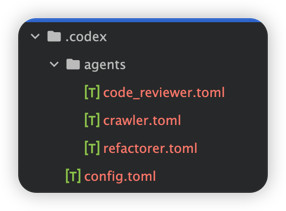
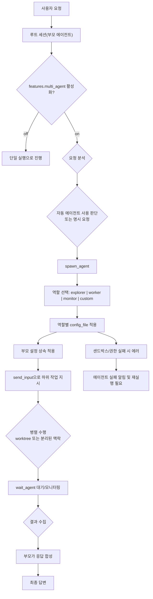

이 글은 공식 문서의 스키마 기준에 맞춰 SubAgent 개념을 정리하고, 이 저장소의 실제 `.codex` 설정으로 바로 적용 가능한 형태를 제공합니다.

## 서론: 왜 SubAgent를 써야 하는가

Codex를 사용하다 보면 특정 작업이 커져 서로 의존되지 않는 일감이 생길 때가 많습니다.
이때 작업을 하위 에이전트로 나눠 처리하면 메인 에이전트의 컨텍스트 소모를 줄이면서 병렬로 효율적으로 진행할 수 있습니다.
대신 처리할 일감이 여러 군데로 쪼개지기 때문에, 토큰 사용량은 오히려 늘어날 수 있습니다.
Codex는 단일 실행만으로도 강력하지만, 프로젝트 탐색과 구현, 리뷰를 한 번에 처리하려고 하면 경로가 길어지고 품질 편차가 생기기 쉽습니다.
그럴 때 SubAgent는 목적별로 역할을 나누는 방식이 효율 적입니다.

서브에이전트 핵심

1. 탐색은 한 에이전트가, 구현은 다른 에이전트가, 리뷰는 또 다른 에이전트가 담당하게 나눠서 처리합니다.
2. 각 에이전트는 부모 컨텍스트를 바탕으로 작업하고 결과를 다시 통합합니다.
3. 병렬 처리로 응답 속도와 탐색 범위를 높일 수 있습니다.

## SubAgent는 무엇인가

공식 문서 기준으로 보면 멀티 에이전트는 `features.multi_agent`가 열리면 동작하며, 부모-하위 간 제어 흐름을 네 단계로 이해할 수 있습니다.

1. 조건이 맞으면 하위 에이전트를 생성한다.
2. 하위 에이전트는 진행 상태와 결과를 부모로 전달하고, 추가 지시가 필요하면 역방향 호출도 가능하다.
3. 부모는 지정된 작업이 끝날 때까지 완료 신호를 기다린다.
4. 하위 에이전트가 완료되면 산출물 반환·리소스 정리 후 종료한다.

역할은 `agents` 섹션으로 등록하고, 이름별로 `description`과 역할용 `config_file`을 둡니다.

공식 문서의 기본 내장 역할은 `default`, `worker`, `explorer`입니다.

- `default`  
  일반적인 폴백 역할로, 분기되지 않은 요청의 기본 실행 경로입니다.
- `explorer`  
  코드베이스 탐색 전용 역할입니다. 파일/심볼/의존성 맵을 만들어 후속 에이전트가 실행할 범위를 정리합니다.
- `worker`  
  실제 변경 작업에 적합한 실행형 역할입니다. 구현, 수정, 리팩터링 같은 산출물 변경을 담당합니다.

정리하면 실무에서는 보통 `explorer`로 탐색·영향 범위를 나눈 뒤 `worker`가 실제 코드를 처리하고,  
`default`는 명확한 분기가 없을 때 폴백으로 쓰는 패턴이 안정적입니다.  
`monitor`는 공식 기본 내장 역할이 아니라, 사용자 정의 에이전트로 추가할 수 있는 패턴입니다.

## 공식 스펙 요약 (문서 기준)

다음은 실제 설정에 반드시 반영해야 할 핵심 스펙입니다.

| 항목                                                           | 설정 의미                                | 반영 포인트                                                              |
| -------------------------------------------------------------- | ---------------------------------------- | ------------------------------------------------------------------------ |
| `features.multi_agent`                                         | 멀티 에이전트 기능 사용 여부             | `true`로 두면 subagent 오케스트레이션이 활성화됩니다.                    |
| `agents.max_threads`                                           | 동시 실행 가능한 하위 에이전트 스레드 수 | 값이 클수록 병렬도는 올라가지만 토큰/자원 사용량도 증가합니다.           |
| `agents.max_depth`                                             | 하위 에이전트 생성 깊이 제한             | 루트(부모 세션) 기준으로 깊이 카운트가 시작됩니다.                       |
| `agents.job_max_runtime_seconds`                               | CSV 기반 배치 작업의 기본 타임아웃       | 반복 작업에서 worker 단위 실행 시간이 길어질 때 한도 제어에 사용됩니다.  |
| `agents.<name>.description`                                    | 어떤 경우에 해당 역할을 쓰는지 판단 근거 | 역할 라우팅의 품질(정확히 어떤 에이전트를 쓸지)을 좌우합니다.            |
| `agents.<name>.config_file`                                    | 역할별 TOML 경로                         | 역할별 `developer_instructions`, `sandbox`를 분리 관리할 수 있습니다.    |
| `approval_policy`, `sandbox_mode`, `sandbox_workspace_write.*` | 샌드박스/승인 동작                       | 기본은 부모를 상속하고, 필요 시 하위 에이전트에서 오버라이드 가능합니다. |

## 이 저장소 기준 `.codex` 실제 설정

현재 저장소의 설정은 다음 구조입니다.

- `.codex/config.toml`
  - `features.multi_agent = true`
  - `agents.max_threads = 6`
  - `agents.max_depth = 2`
  - `agents.job_max_runtime_seconds = 1800`
  - 사용자 정의 역할: `crawler`, `code_reviewer`, `refactorer`
- `.codex/agents/*.toml`
  - 각 역할의 `approval_policy`, `sandbox_mode`, `developer_instructions`, `nickname_candidates`/`features`를 분리해서 관리



특히 `crawler`는 네트워크가 필요한 조사 작업을 위해 `sandbox_workspace_write.network_access = true`를 두고,
`code_reviewer`, `refactorer`는 네트워크를 비활성화해 보안을 줄이는 형태입니다.

아래는 구조 예시입니다.

```toml
# .codex/config.toml (요약)
[features]
multi_agent = true

[agents]
max_threads = 6
max_depth = 2
job_max_runtime_seconds = 1800

[agents.crawler]
model = "gpt-5.3-codex-spark"
description = "Web crawling expert..."
config_file = ".codex/agents/crawler.toml"
nickname_candidates = ["Crawler", "Searchette", "Crawler-01"]
```

```toml
# .codex/agents/crawler.toml (요약)
approval_policy = "on-request"
sandbox_mode = "workspace-write"

[sandbox_workspace_write]
writable_roots = []
network_access = true
```

## 병렬 실행 흐름도

아래 흐름은 실제로 제가 운용할 때의 이해도를 기준으로 정리한 다이어그램입니다.



## `subAgent` 키워드만 써도 되나?

요약하면, 키워드 하나로 모든 동작을 강제한다고 단정하긴 어렵습니다.  
“부모 에이전트가 판단해 자동 생성하거나, 명시적으로 요청해 사용”  
`subagent` 단어의 존재 자체보다, 내가 지시하는 일에 대하여 더 명확하게 잘 알고 있기 때문에 **요청을 어떤 형태로 분할 가능한 작업으로 적는지**가 더 중요합니다.

## 마무리

제 경우 SubAgent를 처음에는 단순히 여러 개의 AI를 각각 실행하는 구조로 생각했습니다.
하지만 실제로 사용해보니, 그보다는 역할을 나눠 특정 작업을 분담하는 구조에 더 가까웠습니다.

각 에이전트가 맡은 영역에서 결과를 만들고,
그 결과를 메인 에이전트에 전달하면,
메인 에이전트가 이를 취합해 다시 활용하는 방식입니다.

이 과정을 보면서 혼자 작업하는 느낌보다는
여러 명이 역할을 나눠 함께 일하는 것과 비슷한 구조라고 느꼈습니다.

어떤 일은 단일 에이전트로 가는 게 좋은지부터 정하는 편이 좋습니다.

- `단일`이 더 나은 경우: 한 문맥 안에서 순차적으로 맥락을 이어가야 하는 일(예: 복잡한 버그의 최종 원인 정리, 하나의 리팩터링 계획 수립 후 연쇄 수정)
- `분리/병렬`이 좋은 경우: 서로 의존이 거의 없는 일감(예: 리서치, 코드 리뷰 항목 분기, 리팩터링 후보 점검, 성능/보안/테스트 분석 분기)

서로 독립인 업무를 같은 요청 안에 섞을 때는, 주로 `작업 A=리서치`, `작업 B=코드 작성`, `작업 C=리뷰`처럼 역할별로 쪼개고 subagent로 돌리고,
이때 **메인 에이전트가 한 번에 감당해야 할 컨텍스트가 줄어든다**는 장점도 있습니다.  
대신 하위 에이전트가 늘어나면 합산 토큰 소비는 확실히 커지므로, 사용 비용·속도 등을 고려해서 사용해야할 것 같습니다.

서브에이전트가 뭘하는지 궁금할떄는
- codex CLI에서 `/agent`를 입력하면 현재 실행 중인 에이전트 목록과 각 에이전트 수행 내용을 확인할 수 있습니다.
- tmux로 터미널을 분할해 세션별 화면을 열어 두면 작업 중인 에이전트의 진행 상황을 병행 확인하기가 편합니다.


## 참고 링크

- [OpenAI Codex config reference](https://developers.openai.com/codex/config-reference/)
- [OpenAI Codex multi-agent docs (search index)](https://developers.openai.com/codex/multi-agent/)
