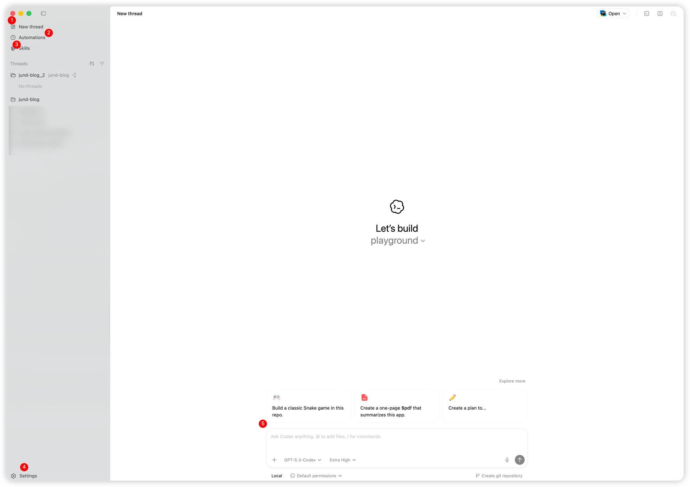
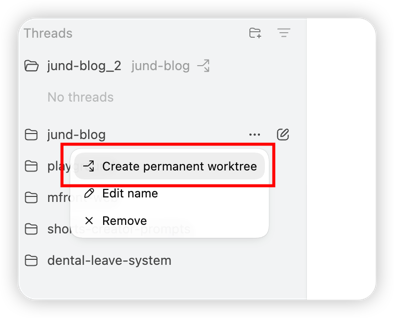
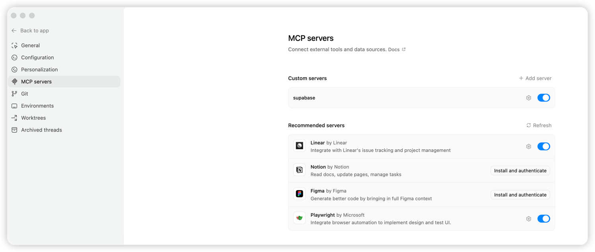
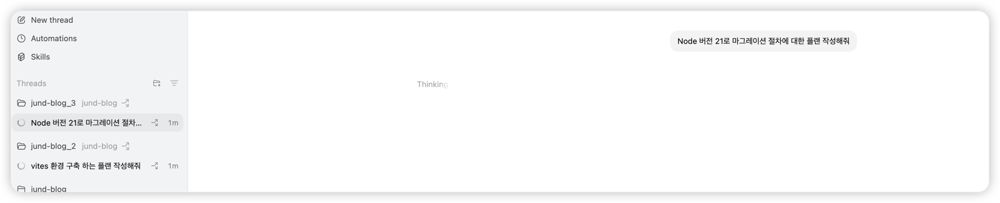

> 현재 회사에서 보안관련 정책으로 Open AI, JetBrains AI 2가지 허용 하고 있어 Codex APP 사용이 가능하여, Codex APP 설치부터 (AGENTS.md, Skills, MCP, Rules, config.toml) 설정 및 설명에 대한 글입니다.

## Codex 사용하기

ChatGPT는 “범용 대화형 언어 모델” 으로 자연어·일반 텍스트 처리에 강점이 있으며, 코딩 관련 작업도 할 수는 있지만 깊이와 자동화 측면에서는 기능이 부족합니다.
반면 Codex는 “개발 작업 자동화에 최적화된 코딩 에이전트”로, 실전 프로젝트 코드 생성, PR 제안, 디버깅 및 테스트 자동화를 지원하는 도구입니다.

Codex는 코드 생성 도구를 넘어, 프로젝트 규칙과 실행 환경까지 같이 관리하는 개발 에이전트에 가깝습니다. 단순히 프롬프트 한 줄로 끝나는 사용보다는
아래 3가지를 셋팅을 해야 생산성이 올라갑니다.

> AI 사용법 및 새로운 AI 기능들이 빠르게 발전하고 있어 해당 블로그 내용은 레거시가 될 수도 있으니 참고 해주세요

codex에서 참고하는 docs 입니다.

1. 작업 지시 체계: `AGENTS.md`, `rules`
2. 재사용 작업 및 특화 기능: `skills`
3. 외부 시스템 연결 프로트콜: `MCP`

이 3가지가 정리되면 "잘 동작하는 한 번"이 아니라 "반복 가능한 워크플로우"를 만들 수 있습니다. (아래에서 자세하게 설명)

## codex.app 설치 및 실행

[Codex 앱을 소개합니다 | OpenAI](https://openai.com/ko-KR/index/introducing-the-codex-app/)

1. Codex 앱 다운로드
2. 계정으로 로그인
3. 작업할 저장소 열기
4. 첫 작업 요청 실행

참고:

- [Codex Quickstart](https://developers.openai.com/codex/quickstart)

### Codex App 구조

1. New Thread : 새로운 작업 디렉토리를 생성합니다.
2. Automations: 자동화 관련 작업 생성합니다. 템플릿 별로 스케줄을 등록하여 백그라운드에서 프롬프트를 실행 할 수 있습니다.
3. skills: codex에서 추천 skills 설치 및 외부 마켓플레이스 skills 설치 리스트를 조회 할 수 있습니다.
4. Settings: codex 앱의 설정을 관리하는 곳입니다. 승인 정책, 샌드박스, MCP 서버, config.toml 등을 설정 및 수정 할 수 있습니다.
5. prompt: Thread별 프롬프트를 실행 할 수 있습니다.



### WorkTree 생성

Thread에 대한 worktree을 생성하여 스레드 별로 멀티 에이전트를 실행 시킬 수있습니다.



### MCP Servers 설정

Codex에서 외부 시스템과 통신하기 위한 MCP 서버를 설정할 수 있습니다.



## AGENTS.md 이해하기

[AGENTS.md](https://agents.md/)는 "저장소에서 에이전트가 어떻게 행동해야 하는지"를 정의하는 문서입니다.

AGENTS.md란?

소프트웨어 프로젝트 루트에 놓는 Markdown 파일 형식의 오픈 표준으로, AI 기반 코딩 에이전트에게 프로젝트의 맥락(Context) 과 동작 지침 을 명시적으로 전달하는 데 쓰입니다.
사람이 읽는 README.md와 달리, AI 코딩 도구들이 프로젝트를 이해하고 정확하게 작업하도록 돕는 목적입니다

공식 가이드 기준으로 Codex는 AGENTS 문서를 계층적으로 읽습니다.

1. 글로벌 스코프: `~/.codex/AGENTS.override.md` 우선, 없으면 `~/.codex/AGENTS.md`
2. 프로젝트 스코프: 프로젝트 루트부터 현재 작업 디렉터리까지 상위 폴더를 탐색
3. 근접 우선: 현재 디렉터리에 가까운 지시가 상위 지시를 덮어씁니다.

추가로 프로젝트 문서 로딩은 기본 바이트 제한(`project_doc_max_bytes`) 영향을 받습니다. 문서가 너무 길면 핵심 규칙이 잘릴 수 있으므로, AGENTS 문서는 짧고 강하게 쓰는 편이 안전합니다.

이 저장소 기준으로 디렉토리 경로

- `저장소/AGENTS.md`

### AGENTS.md Nextjs 템플릿

```md
# Project Agent Guide

## Project Overview

- Framework: Next.js 14+
- Router: App Router
- Language: TypeScript (strict mode)
- Package manager: pnpm

## Setup Commands

- Install deps: `pnpm install`
- Dev server: `pnpm dev`
- Build: `pnpm build`
- Start: `pnpm start`
- Lint: `pnpm lint`
- Test: `pnpm test`

## Routing Rules

- Use App Router (`/app` directory)
- Default to Server Components
- Use `"use client"` only when necessary
- Do not create pages inside `/pages`

## Data Fetching Rules

- Prefer Server Components for data fetching
- Use Server Actions for mutations
- Avoid client-side fetching unless interactive requirement exists

## Styling Rules

- Tailwind CSS only
- No inline styles
- Use className convention

## API Rules

- Use Route Handlers inside `/app/api`
- Avoid legacy API routes in `/pages/api`

## Environment Variables

- Use `NEXT_PUBLIC_` prefix only for client-safe variables
- Never expose secret keys

## Testing Rules

- Use Jest + React Testing Library
- Add test when creating new component

## Deployment

- Target: Vercel
- Ensure build passes before PR
```

참고:

- [AGENTS.md guide](https://developers.openai.com/codex/guides/agents-md/)

## Skills 설계와 운영

Skills는 상황에 맞게 자동으로 로딩되는 도메인 전문 지식 패키지입니다.

핵심은 트리거 방식이 2가지라는 점입니다.

1. 암시적 트리거: Codex가 `description`을 보고 현재 작업에 필요하다고 판단하면 자동으로 로드합니다.
2. 명시적 트리거: 사용자가 스킬 이름을 직접 지정하면 우선 로드합니다.

조건이 맞으면 자동으로 발동되지만, 문맥이 불명확하면 발동하지 않을 수도 있으므로 `description` 품질이 중요합니다. (skills를 만들었지만 제대로 skill을 읽지않는 문제가 발생 했습니다)

스킬은 `SKILL.md` 하나만 두는 방식도 가능하지만, 실제 운영에서는 폴더 단위로 워크플로우와 자료를 같이 묶는 편이 좋습니다.
이 구조는 정리 목적뿐 아니라, 필요한 파일만 순차적으로 읽게 해서 토큰을 점진적으로 사용한다는 의미가 있습니다.

```text
my-skill/
├── SKILL.md
├── scripts/
├── references/
└── assets/
```

모든 스킬은 `SKILL.md`를 기준으로 동작합니다.

```md
---
name: supabase-postgres-best-practices
description: Postgres performance optimization and best practices from Supabase. Use this skill when writing, reviewing, or optimizing Postgres queries, schema designs, or database configurations.
license: MIT
metadata:
  author: supabase
  version: "1.1.0"
  organization: Supabase
  date: January 2026
  abstract: Comprehensive Postgres performance optimization guide for developers using Supabase and Postgres. Contains performance rules across 8 categories, prioritized by impact from critical (query performance, connection management) to incremental (advanced features). Each rule includes detailed explanations, incorrect vs. correct SQL examples, query plan analysis, and specific performance metrics to guide automated optimization and code generation.
---

Supabase Postgres 모범 사례
Supabase에서 관리하는 PostgreSQL용 종합 성능 최적화 가이드입니다. 자동화된 쿼리 최적화 및 스키마 설계를 위한 지침을 제공하며, 영향력에 따라 우선순위가 지정된 8개 범주의 규칙을 포함합니다.

지원 시기
다음과 같은 경우에 이 지침을 참조하십시오.

SQL 쿼리 작성 또는 스키마 설계
인덱스 구현 또는 쿼리 최적화
데이터베이스 성능 문제 검토
연결 풀링 또는 스케일링 구성
Postgres 특정 기능에 최적화
행 수준 보안(RLS) 작업

....
```

`description`은 스킬 선택 정확도를 좌우하는 핵심 필드입니다.

활성화 최적화 3단계 전략

Level 1: description 최적화
Level 2: 문서 통합 및 맥락 연결
Level 3: 명시적 평가 훅 추가

피해야 할 안티 패턴

- 모호한 트리거
- 너무 많은 옵션 나열
- 중첩 문서 구조
- 시간 의존 정보 포함

[skills 최적화 가이드](https://gist.github.com/mellanon/50816550ecb5f3b239aa77eef7b8ed8d)

Skill Hub 마켓플레이스 링크

- [SkillHub](https://www.skillhub.club/)
- [AgentSkills.best](https://agentskills.best/)
- [SkillsMP](https://skillsmp.com/)
- [Skills.sh](https://skills.sh/)
- [awesome-claude-skills](https://github.com/ComposioHQ/awesome-claude-skills)

참고:

- [Codex Skills](https://developers.openai.com/codex/skills)

## 5) MCP 프로토콜과 추천 MCP 선택법

MCP(Model Context Protocol)는 모델이 외부 도구/데이터 소스와 표준 방식으로 통신하도록 만든 프로토콜입니다. Codex 문서 기준으로는 MCP 서버를 앱 UI 또는`~/.codex/config.toml`에서 연결할 수 있습니다.

codex mcp 추가 명령어

```shell
codex mcp add <server-name> --env VAR1=VALUE1 --env VAR2=VALUE2 -- <stdio server-command>
```

contex7 MCP 설치 예시 명렁어

```shell
codex mcp add context7 -- npx -y @upstash/context7-mcp
```

참고:

- [Codex MCP](https://developers.openai.com/codex/mcp)
- [MCP User Quickstart (SSE/Streamable HTTP)](https://modelcontextprotocol.io/quickstart/user)
- [MCP Servers Registry](https://github.com/modelcontextprotocol/servers)

## Rules 사용법 (실험적 기능)

Rules는 "어떤 명령을 자동 허용/요청/금지할지"를 제어하는 정책 레이어입니다. AGENTS.md와 역할이 다릅니다.

1. AGENTS.md: 작업 방식/문맥/목표를 설명합니다.
2. Rules: 명령 실행 정책을 강제합니다.

공식 문서 기준으로 Codex는 Team Config 위치들을 기준으로 `rules/` 디렉터리의 `.rules` 파일을 스캔합니다. 충돌 시에는 더 제한적인 결정이 우선됩니다.

### rules 예시 (코드 스타일, 테스트 우선, 금지 명령)

아래는 로컬 기본 규칙 파일과 같은 함수형 문법 예시입니다.

```rules
prefix_rule(pattern=["npm", "run", "check:prettier"], decision="allow")
prefix_rule(pattern=["npm", "run", "test"], decision="allow")
prefix_rule(pattern=["git", "reset", "--hard"], decision="forbid")
```

참고:

- [Codex Rules](https://developers.openai.com/codex/rules)

## config.toml 설정

Codex 기본 설정 파일 경로는 `~/.codex/config.toml`입니다. 최소 설정에서는 모델, 승인 정책, 샌드박스, MCP 서버, 웹 검색 옵션을 지정 할 수 있으며, 내가 생성한 Threads에 대한 항목 리스트도 볼 수 있습니다.

```toml
model = "gpt-5-codex"
approval_policy = "on-request"
sandbox_mode = "workspace-write"

[tools]
web_search = true

[mcp_servers.playwright]
command = "npx"
args = ["@playwright/mcp@latest"]

[mcp_servers.docs]
url = "https://example.com/mcp"
```

참고:

- [Codex Config basics](https://developers.openai.com/codex/config-basic)
- [Codex Config reference](https://developers.openai.com/codex/config-reference)

## 멀티 에이전트 운영

멀티 에이전트는 "독립 작업을 동시에 분리"할 때 효과가 큽니다. 예를 들어 다음처럼 나누면 충돌이 줄어듭니다.

1. 에이전트 A: 문서 작성
2. 에이전트 B: 코드 변경
3. 에이전트 C: 테스트와 검증

Codex App에서 Threads 별로 workTree를 생성하여 각각 작업을 시킨다.

2개 worktree Threads에서 각 에이전트 별로 작업을 실행시켜 작업을 더 효율적으로 진행 할 수 있다.



## AI 시대 코딩

회사에서 `JetBrains AI`를 구매해줘서 사용해 봤습니다. `WebStorm IDE`와 연동이 좋아서 `커밋 단위 리뷰`, `커밋 메시지 작성`, `코드 자동완성` 같은 기능을 자주 활용했습니다. 다만 `토큰 사용량`을 직접 확인하기 어렵고, `코드 컨텍스트` 전부 읽어 작업이 자주 중단(오류발생)되는 문제가 있었습니다. 중단 이후에는 `프롬프트`를 처음부터 다시 작성해야 하는 경우도 반복됐습니다.

또한 `Skills`, `MCP`, `AGENTS 문서` 기반 운영 측면에서는 `업데이트 주기`가 느려서, 새 기능을 바로 반영하기 어려웠습니다. 반면 이번에 `Claude Code`와 유사한 `Codex`를 사용해 보면서, 개발 경험이 한 단계 더 나아졌다고 느꼈습니다.

특히 `Skills`를 도입한 뒤에는 같은 맥락의 `프롬프트`를 매번 길게 다시 쓰지 않아도 되었고, `토큰 사용`을 더 효율적으로 관리할 수 있어 `컨텍스트 초과`로 중단되는 현상이 사라졌습니다.

현재는 운영 중인 서비스에 이 방식을 녹여서 `페이지 단위 스킬`을 분리하고, 서비스별 `비즈니스 로직`과 `앱 간 연동 규칙`을 문서화해 AI가 더 정확하게 동작하도록 작업과 테스트를 진행하고 있습니다.

이제는 제가 직접 코드를 많이 작성하기보다, 코딩을 더 잘하는 AI가 올바른 방향으로 일할 수 있도록 `규칙`과 `스킬`을 설계하는 역할이 점점 더 중요해졌다고 느낍니다.

AI 발전으로 인해 그동안 미뤄두었던 `테스트 코드 작성`과 `이벤트 페이지 자동화`도 같은 맥락에서 다시 추진하고 있습니다. 결국 중요한 것은 "더 빨리 코딩"이 아니라, "`AI가 일관되게 잘 코딩하도록 시스템을 설계`"하는 역량이 중요한것 같습니다.
