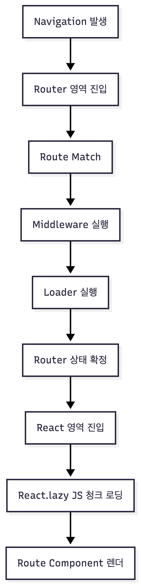

---

# 렌더보다 먼저 실행되는 코드: React Router v7 middleware와 loader

---

## 전제 조건과 테스트 환경 (필수 참고)

이 글은 **React Router v7의 middleware와 loader 기능을 SPA 환경에서 어떻게 이해하고 사용해야 하는지**에 대하여 작성되어 했고,
모든 내용은 아래 환경을 기준으로 테스트하고 정리했다.

```txt
- React v18
- React Router v7.9.6
- Vite
- SPA (CSR)
- Data Mode
- Client Middleware 사용
- React.lazy 기반 코드 스플리팅
```

> SSR, server middleware, Remix 환경은 다루지 않는다.

따라서 이 글에서 말하는 middleware와 loader는 **모두 브라우저에서 실행되는 클라이언트 로직**이다.

---

## 1. React Router v7에서 말하는 middleware와 loader

### 1-1. middleware란 무엇인가

React Router v7의 middleware는 **네비게이션 과정 중, loader나 action이 실행되기 전에 개입할 수 있는 라우터 레벨 로직**이다.
Express 미들웨어와 달리 HTTP 요청을 직접 처리하지 않고, **라우팅 흐름을 제어하는 역할**을 가진다.

이전 react router v6 사용 시 화면 진입전에 특정 로직을 넣으려면 HOC 컴포넌트를 만들어서 처리했어야 했지만,
v7부터는 라우트 설정에 middleware를 사용하여 페이지가 렌더링 이전에 좀 더 앞단에서 제어가 가능해졌다.

SPA 환경에서는 주로 다음 용도로 사용된다.

* 인증 여부 확인
* 권한 없는 페이지 진입 차단
* 빠른 리다이렉트 처리
* 초기값 데이터 셋팅

middleware는 **라우터가 관리하는 상태로 동작하며, React 컴포넌트 렌더링과는 별개로 실행된다**는 것이다.


### 1-2. loader란 무엇인가

loader는 **라우트 진입 시 필요한 데이터를 준비하는 함수**다.
컴포넌트가 렌더되기 전에 실행되며, React Router가 관리하는 상태로 저장된다.

loader가 없을 때, 해당 화면에서 필요한 초기 데이터를 useEffect 마운트 시점에 데이터를 패칭하여 가져와서 사용 했었다.

이로 인해 컴포넌트 플리커링 현상이 있었다. 예를 들면 로그인 여부에 따라서 다른 UI를 보여줘야 하는데,
useEffect에서 데이터를 패칭하는 동안은 기본 UI가 잠시 보였다가 데이터가 도착한 후에야 올바른 UI로 바뀌는 현상이다.
(이 현상을 막는 방법은 미리 페칭이 끝날때까지 렌더링을 하지 않는 꼼수는 있지만 복잡도가 올라가고 유지보수가 어려워진다.)

Router 구조가 부모 -> 자식 -> 자식2 구조로 각 route 마다 loader를 정의 했다면 마지막 자식2 페이지가 렌더링 되고 useRouteLoaderData() 훅을
통해서 데이터를 가져 올 수있다.

loader를 사용하면

* 컴포넌트 내부 `useEffect`에서 하던 데이터 패칭을 라우터 영역(middleware)으로 옮길 수 있고
* 페이지 단위로 데이터 흐름을 명확하게 정의할 수 있어 라우터 영역에 대한 flow 처리를 하면 더 쉽게 관리할 수 있다.

loader의 핵심적 기능 
* 화면이 렌더되기 전에 필요한 데이터를 준비하는 것 
* 페이지 별로 로더를 정의하여 데이터 패칭 로직을 분리하는 것


## 1-3. React Router 데이터 관리`context`

React Router의 **`context`**는 라우팅 과정(특히 **loader / action**)에서 공통으로 필요한 값을 **요청 단위로 주입(inject)** 해서 꺼내 쓰도록 제공하는 “라우터 전용 컨텍스트”입니다.  
React의 `Context.Provider`처럼 컴포넌트 트리 렌더링을 위한 전역 상태를 흘려보내는 개념이라기보다, **라우터가 loader/action을 실행할 때 함께 전달하는 실행 환경**에 가깝습니다.

### 왜 쓰나?
- **loader/action에서 인증 정보, API 클라이언트, 설정 값** 등을 매번 import/싱글톤으로 잡지 않고, 라우터 생성 시점에 한 번 구성해서 주입할 수 있습니다.
- 테스트가 쉬워집니다(컨텍스트만 바꿔서 loader/action 단위 테스트 가능).
- 요청/세션별 값(예: 로그인 상태, locale 등)을 **loader/action의 인자로 일관되게 전달**할 수 있습니다.

### 어디서 접근하나?
- `loader({ request, params, context })` 또는 `action({ request, params, context })`의 **세 번째 축인 `context`**에서 접근합니다.
- 보통 `context.get(...)` 형태로 꺼내 쓰게 “토큰”을 만들어두고(예: `createContext()`), 이를 키로 저장/조회합니다.

---

## 간단 예시 코드 (인증 컨텍스트를 loader에서 읽기)

아래 예시는 “인증 정보(auth)를 context에 넣어두고, 특정 페이지 loader에서 로그인 여부를 검사”하는 흐름이다.

```typescript  
import { createContext, LoaderFunctionArgs } from 'react-router';
  // router context 
export const authContext = createContext<AuthContextValue>(defaultAuthContext);  
  
export function getAuthFromContext(args: LoaderFunctionArgs): AuthContextValue {  
    return args.context.get(authContext) as AuthContextValue;  
}  
  
export const authMiddleware: MiddlewareFunction = async ({ request, context }, next) => {  
    const url = new URL(request.url);  
    const pathname = url.pathname;  
  
    // 로그인 상태 체크 API  
    const { isLogin, error } = await authLogin();  
    
    if(error)
    throw redirect(`/login?returnUrl=${encodeURIComponent(new URL(args.request.url).pathname)}`); 
    // 인증 정보를 context에 저장  
    const authValue: AuthContextValue = {  
        isLogin,  
    };  
    context.set(authContext, authValue);  
  
    return await next();  
};  

export function createAppLoader(routeMeta: AppRouteMeta): LoaderFunction { 
    return async (args: LoaderFunctionArgs): Promise<any> => {  
        const auth = getAuthFromContext(args);  
  
        return {  
            auth,  
        };  
    };  
}

const router = createBrowserRouter([  
    {  
        element: <RootLayout key="root-page" />,  
        id: 'root-page',  
        loader: createAppLoader,  
        // 인증 미들웨어 적용  
        middleware: [authMiddleware],  
        errorElement: <RouterErrorBoundary />,  
        children: RouteChild()  
    }  
]);

// 실제 화면
function Page() {
	// loader hook을 통해 라우터 주입한 context 데이터를 가져온다.
	const loaderData = useLoaderData() as AuthLoaderData;  
	const auth = loaderData?.auth;
 // 화면 렌더링
	return JSX.Element
}
```  

위 코드를 요약정리 하면 다음과 같다.

router에 middleware, loader를 등록 하고  authMiddleware에서 로그인 체크여부 API 를 호출하고 응답 값을 context에 set 처리를 하고 loader에서 context get으로 가져와서 화면으로 내려준다.

화면까지 내려가지 않고 인증이 실패하면 middleware에서 `throw redirect(`/login?returnUrl=${encodeURIComponent(new URL(args.request.url).pathname)}`);`
throw redirect 통해 URL를 이동 시켜도 된다.
  
---

## 2. 라우터 영역 vs 리액트 영역

### 2-1. 라우터 영역이란 무엇인가

라우터 영역은 **React Router가 실행되는 영역**이다.
이 영역에서는 UI 렌더링이 아니라, **네비게이션과 데이터 흐름**을 관리한다.

라우터 영역에서 발생하는 일들

* URL 변경 감지
* route 매칭
* middleware 실행
* loader 실행
* navigation 상태 확정

이 단계에서는 아직 React 컴포넌트는 렌더되지 않는다.


### 2-2. 리액트 영역이란 무엇인가

리액트 영역은 **React 컴포넌트 트리가 실제로 렌더링되는 영역**이다.

* route에 매칭된 element 렌더
* `React.lazy`를 통한 JS 청크 로딩
* Suspense fallback 처리
* UI 상태 업데이트

중요한 점은, **리액트 영역은 라우터 영역의 결과를 기반으로 렌더링만 수행한다**는 것이다.

---

## 3. 전체 실행 흐름 한 눈에 보기

SPA 환경에서 네비게이션이 발생했을 때의 전체 흐름은 다음과 같다.



---

## 4. middleware와 loader 실행 순서 자세히 보기

### 4-1. middleware 실행 순서

부모/자식 route 모두 middleware를 가지고 있다면 실행 순서는 다음과 같다.

* root → parent → child 순서로 실행
* child route에서 `next()`를 호출하면 loader 실행이 트리거된다
* 이후 실행 흐름은 child → parent → root 순으로 되돌아온다

middleware 중간에 redirect나 error가 발생하면, 이후 단계는 실행되지 않는다.


### 4-2. loader 실행 시점

loader는 **leaf route에서 `next()`가 호출되는 순간 실행**된다.
이때 실행 대상은 “이번 네비게이션에 필요한 loader list”이다. 즉, 부모에 있는 loader도 실행된다.


---

## 5. 라우터 영역에서 리액트 영역으로 넘어가는 순간

### 5-1. 라우터 영역에서 끝나는 일들

라우터 영역에서는 다음 작업들이 완료된다.

* middleware / loader 실행
* loaderData 및 context 저장
* navigation 상태 확정

이 시점에서 **어떤 화면을 렌더할지에 대한 모든 정보가 준비**된다.


### 5-2. 리액트 영역에서 시작되는 일들

라우터 상태가 확정되면 React 렌더링이 시작된다.

* route에 매칭된 element 렌더
* 해당 element가 `React.lazy`라면 JS 청크 import 시작
* 로딩 중에는 `<Suspense fallback>`이 먼저 보일 수 있음

즉, **데이터는 준비됐지만 화면 JS가 아직 로딩 중인 상태**가 가능하다.


### 5-3. loader/context 데이터는 어떻게 사용되는가

loader에서 반환한 데이터는 다음 훅으로 접근한다.

* `useLoaderData`
* `useRouteLoaderData`

middleware에서 저장한 context 데이터 역시, 이후 loader나 컴포넌트에서 접근 가능하다.
이 데이터들은 모두 **라우터가 관리하는 상태**다.

useLoaderData() 훅은 router 페이지에 연결된 loader context 데이터를 가져와 사용할 수 있다.
useRouteLoaderData(:id) 훅은 router id 별로 정의한 loader context 데이터를 사용할 수 있다.


### 5-4. 여러개 middleware, loader가 동작하는 flow

아래 순서도를 보면 동작 흐름에 대하여 좀 더 명확히 이해할 수 있다.

예제 코드 일부
```typescript

/** -----------------------------
 *  Root middleware / loader
 *  ----------------------------- */
const rootAuthMiddleware: MiddlewareFunction = async ({ context, request }, next) => {
  const me = await fetchMe();
  if (!me) throw redirect("/login");

  // 예시: context에 유저 정보 저장 (loader/컴포넌트에서 활용 가능)
  context.set("me", me);

  return next();
};

const rootPageInfoMiddleware: MiddlewareFunction = async ({ context }, next) => {
  context.set("pageInfo", { app: "my-spa" });
  return next();
};

async function rootLoader({ context }: LoaderFunctionArgs) {
  const me = context.get("me"); // rootAuthMiddleware가 저장한 값
  const pageInfo = context.get("pageInfo");

  return {
    from: "rootLoader",
    me,
    pageInfo,
  };
}

/** -----------------------------
 *  Child1 middleware / loader
 *  ----------------------------- */
const child1Middleware: MiddlewareFunction = async ({ context }, next) => {
  // 예: 역할 체크
  const me = context.get("me");
  if (me?.role !== "admin") throw redirect("/403");

  context.set("child1Flag", true);
  return next();
};

async function child1Loader({ context }: LoaderFunctionArgs) {
  return {
    from: "child1Loader",
    child1Flag: context.get("child1Flag"),
  };
}

/** -----------------------------
 *  Child1-1 middleware / loader
 *  ----------------------------- */
const child11Middleware: MiddlewareFunction = async ({ context }, next) => {
  context.set("child11Trace", "visited child1-1");
  return next();
};

async function child11Loader({ context }: LoaderFunctionArgs) {
  return {
    from: "child11Loader",
    trace: context.get("child11Trace"),
  };
}

/** -----------------------------
 *  Child2 middleware / loader
 *  ----------------------------- */
const child2Middleware: MiddlewareFunction = async ({ context }, next) => {
  context.set("child2Flag", "ok");
  return next();
};

async function child2Loader({ context }: LoaderFunctionArgs) {
  return {
    from: "child2Loader",
    child2Flag: context.get("child2Flag"),
  };
}

/** -----------------------------
 *  Router definition
 *  ----------------------------- */
export const router = createBrowserRouter([
  {
    id: "root",
    element: <RootLayout />,
    errorElement: <RouterErrorBoundary />,
    middleware: [rootPageInfoMiddleware, rootAuthMiddleware],
    loader: rootLoader,
    children: [
      {
        id: "child1",
        path: "/child1",
        element: (
          <SuspensePage>
            <Child1Layout />
          </SuspensePage>
        ),
        middleware: [child1Middleware],
        loader: child1Loader,
        children: [
          {
            id: "child1-1",
            path: "child1-1",
            element: (
              <SuspensePage>
                <Child11Page />
              </SuspensePage>
            ),
            middleware: [child11Middleware],
            loader: child11Loader,
          },
        ],
      },
      {
        id: "child2",
        path: "/child2",
        element: (
          <SuspensePage>
            <Child2Page />
          </SuspensePage>
        ),
        middleware: [child2Middleware],
        loader: child2Loader,
      },
    ],
  },
]);

/** -----------------------------
 *  App usage
 *  ----------------------------- */
export function AppRouter() {
  return <RouterProvider router={router} />;
}
```


---

## 6. 실무에서 middleware와 loader는 언제 쓰면 좋을까

middleware는 **“이 라우트에 들어가도 되는가?”**를 판단할 때 적합하다.

* 로그인 여부 확인
* 권한 없는 페이지 차단
* loader 실행 이전에 빠른 redirect

loader는 **“이 화면을 렌더하기 위해 필요한 데이터”**를 준비할 때 적합하다.

* 페이지 진입 필수 데이터
* 여러 컴포넌트에서 공유되는 데이터

두 기능을 섞어 쓰기보다는, **책임을 명확히 분리하는 것이 유지보수에 유리하다.**

예를 들어 Root 영역에서 체크해야하는 middleware (로그인 체크, 페이지 정보...)
실제 렌더링 되는 router에서 실행되는 middleware (초기 상태 데이터 리스트) 

middleware를 여러개 공통으로 만들어 화면별로 조합으로 사용하다보니 유지 보수도 깔끔하지는 장점이 있다.

---

## 7. 주의사항 및 팁

### 7-1. 클라이언트 미들웨어는 보안이 아니다

SPA 환경에서 middleware는 어디까지나 **클라이언트 가드**다.
실제 보안 검증은 반드시 API 서버에서 수행되어야 한다.


### 7-2. “렌더랑 동시에 실행된다”는 착각

middleware와 loader는 **렌더 전에 실행**된다.
또 운영상 배포를 주기적으로 하다보면 청크파일이 변경되면서 에러 페이지를 노출 되는 케이스가 있는데
middleware, loader를 통하면 청크 JS를 로드하기 전에 청크파일 변경 여부를 알 수 도있다.

청크가 변경되었다면 리액트 렌더링 단계 진입 전에 강제로 새로고침을 유도하는 로직을 middleware에 넣을 수 있다.


### 7-3. middleware 로직이 과하면 안된다.

Middleware 영역에서 무거운 API를 호출하거나 복잡한 비즈니스 로직을 실행할 경우, 그만큼 사용자에게 흰 화면이 노출되는 시간이 길어질 수 있으므로 주의가 필요하다.

앱에서 사용하는 초기 레이아웃 데이터, 인증·검증·인가 로직 등을 무분별하게 middleware 영역으로 이동하기보다는, 반드시 영향도 분석과 함께 실제로 더 효율적인 선택인지 충분히 고민한 후 작업해야 한다.

API 응답이 지연되는 상황은 언제든 발생할 수 있으므로,
타임아웃을 설정해서 오랫동안 대기하지 않도록 하고, 일정 시간 초과 시 즉시 화면에 진입시키거나 Error Boundary로 이동시키는 로직은 고민하여 추가 해야할 것 같다.


---

## 8. 마치며

React Router v7의 middleware와 loader는 필수 기능은 아니다.
하지만 **라우터가 데이터 흐름을 주도하도록 설계하면**, 컴포넌트는 훨씬 단순해진다.

이 기능들의 핵심은 “편의성”이 아니라 **실행 흐름을 명확하게 만드는 것**이다.

---


reference
- https://reactrouter.com/how-to/middleware
- https://reactrouter.com/api/hooks/useLoaderData
