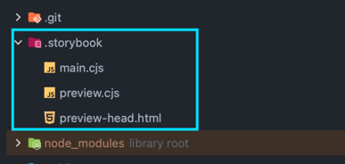
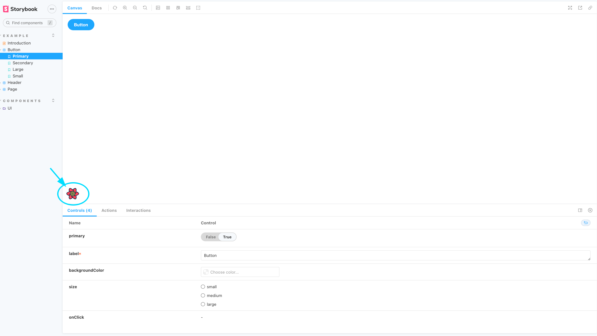
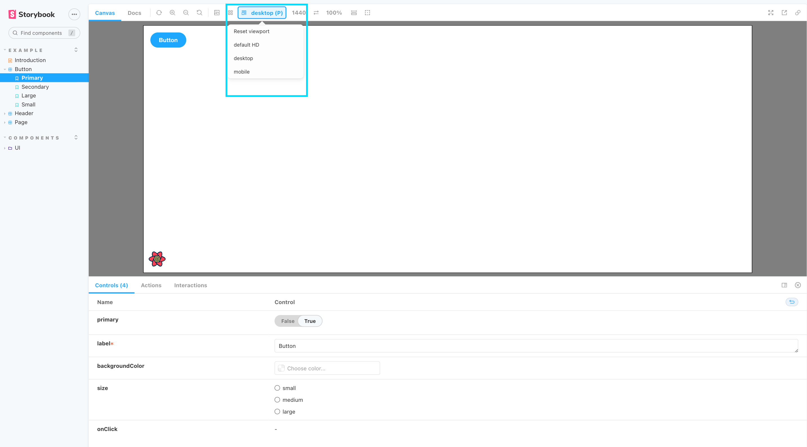
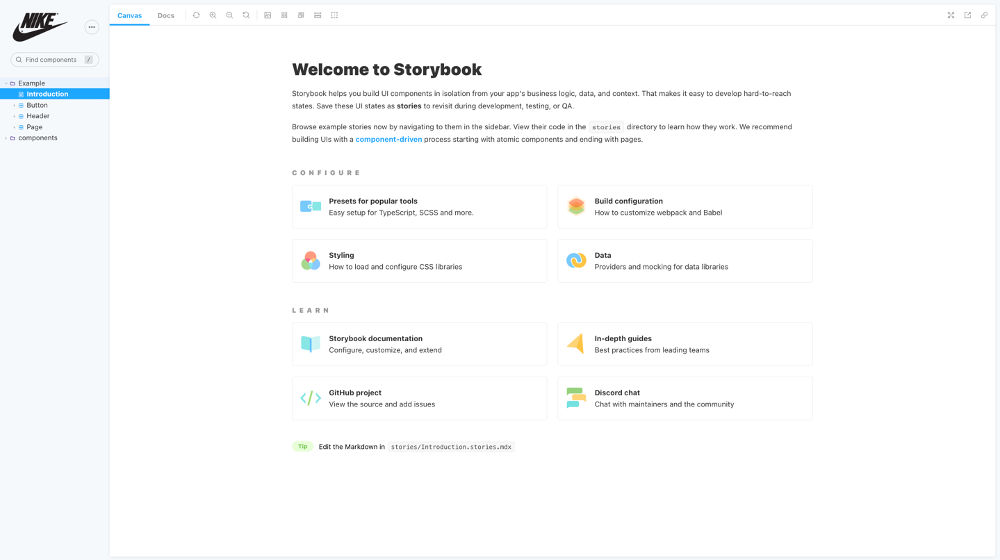

## Storybook 설정 및 옵션


스토리북을 설치하면 .storybook 디렉토리가 생성되며, 해당 디렉토리에서 스토리북 관련 환경을 설정합니다.
확장자가 cjs로 되어있는데 
> CJS 확장자 =>javascript를 브라우저에서만 아니라, 다른 곳에서도 사용할 수 있게 해주는 API
> 
> CJS --> ESM 사용하기 위해서 main.cjs preview.cjs --> main.js, preview.js로 변경 했습니다.
### main.js
main파일 에서는 스토리북을 빌드 및 실행하는 설정 정보들을 추가하거나 플러그인을 추가할 수 있습니다.
1. storybook addon 추가
2. webpack 설정정보 추가
3. vite 설정정보 추가
4. storybook config 및 환경 변수 추가

4가지 정도 설정 정보를 커스텀하게 추가 할 수 있습니다.

실제로 간단하게 추가된 환경 정보를 보면

```javascript
module.exports = {
  "stories": [
    "../src/**/*.stories.mdx",
    "../src/**/*.stories.@(js|jsx|ts|tsx)"
  ],
  "addons": [
    "@storybook/addon-links",
    "@storybook/addon-essentials",
    "@storybook/addon-interactions"
  ],
  "framework": "@storybook/react",
  "core": {
    "builder": "@storybook/builder-vite"
  },
  "features": {
    "storyStoreV7": true
  }
}

```

`stories`는 stories 파일을 읽어 드리는 path 입니다.

src 경로 안에 stories 파일을 넣어야 Storybook에서 볼 수 있습니다.
> 경로를 지정할 때 node_modules 경로는 제외 해야한다. 만약 포함이 되면 노드모듈 안에 있는 stories파일을 전부 불러오기 떄문에 너무 많아서 오류가 발생합니다.

- `addons` 스토리북에서 제공하는 addons 라이브러리를 설치하여 추가해서 사용합니다.

- `framework` 스토리북은 vue, react, svelte, etc 많은 프레임워크를 지원하기 때문에 적어줘야 합니다.

- `core` 스토리북 동작하는 코어 설정을 추가합니다

- `features` 스토리북에서 제공하는 기능을 사용하고 싶을 때 옵션을 추가합니다 ([config 정보](https://storybook.js.org/docs/react/configure/overview))
>storyStoreV7": true 옵션은 v7에서 사용되는 최적화 및  global값을 사용하기 위에 자동 추가가 되어있다.(스토리북 버전 v6 사용하는 경우 옵션을 줘야한다.)


### webpack & vite 설정 추가 
```
{
    webpackFinal: async (config) => ({
        ...config
    }),
     viteFinal: async (config, {configType}) => {
     return config;
    })
}
```

main.js에 `webpackFinal`은 웹팩 관련 설정을 셋팅을 하고,  `viteFinal`은 vite 관련 설정을 셋팅 하면 됩니다.

완성된 파일
```javascript
module.exports = {
  stories: ['../src/**/*.stories.mdx', '../src/**/*.stories.@(js|jsx|ts|tsx)'],
  addons: [
    // '@storybook/addon-controls',
    '@storybook/addon-links',
    '@storybook/addon-essentials',
    '@storybook/addon-interactions',
    '@storybook/preset-create-react-app',
    // '@storybook/addon-actions',
  ],
  webpackFinal: async (config) => ({
    ...config,
  }),
  viteFinal: async (config, { configType }) => {
    const env = loadEnv(config.mode, process.cwd())
    if (process.env.NODE_ENV === 'development') {
      config.server.host = true
    } else {
      // prod
      config.build.sourcemap = false
    }

    config.resolve.alias = [
      {
        find: '@',
        replacement: path.resolve(__dirname, '../src'),
      },
    ]
    config.plugins = [
      ...config.plugins,
      svgrPlugin({
        svgrOptions: {
          icon: true,
        },
      }),
      tsconfigPaths({
        projects: [path.resolve(path.dirname(__dirname), '', 'tsconfig.json')],
      }),
    ]
    return config
  },
  framework: '@storybook/react',
  core: {
    builder: '@storybook/builder-vite',
  },
  typescript: {
    checkOptions: {},
    reactDocgen: 'react-docgen-typescript',
  },
  features: {
    storyStoreV7: true,
    interactionsDebugger: true, // 👈 Enable playback controls
    buildStoriesJson: true,
  },
}

```

vite 환경으로 구성 중이라 vite 사용에 필요한 `svgrPlugin`, `alias`, `tsconfigPaths` 설정 정보를 셋팅 했습니다.

### preview.js
preview 파일은 스토리북 서버를 띄웠을 때 canvas 영역에 해당되는 설정을 하는 파일 입니다.

단 개별 stories에서 설정도 가능하지만 preview.js에서는 global, 공통처리가 가능합니다.
파일을 열어보면
```javascript
export const parameters = {
  actions: { argTypesRegex: "^on[A-Z].*" },
  controls: {
    matchers: {
      color: /(background|color)$/i,
      date: /Date$/,
    },
  },
}

```
스토리북에서 사용하는 기본 `parameters` , `decorators`를 나의 스토리북에 맞도록 설정을 하면 됩니다.

react-query, redux, GlobalStyle, theme, 등등 다양한 처리를 넣을 수 있습니다.

다양한 셋팅 정보는 ([여기](https://storybook.js.org/docs/react/essentials/introduction))에서 볼 수 있습니다.

### decorators 
`decorators` 스토리북에서 최초 진입점에 대하여 다양한 설정을 할 수 있습니다.

예를 들어서 스토리북에서 react-query 사용하기 위해 queryClient를 추가할 수 있습니다.

1. 최초 제일 먼저 실행되는 tsx 파일 생성합니다. (StorybookApp.tsx) 
```javascript
export const StorybookApp = (
    StoryComp: Story
) => {

  return (
    <div style={{width: '100%', height:'100%'}}>
      <CssBaseline />
      <QueryClientProvider client={queryClient}>
        <ReactQueryDevtools initialIsOpen={false} />
          <StoryComp />
      </QueryClientProvider>
    </div>
  )
}
```
생성한 파일을 preview decorators에 추가 합니다.

```javascript
import { StorybookApp } from './StorybookApp'

export const parameters = {
  actions: { argTypesRegex: "^on[A-Z].*" },
  controls: {
    matchers: {
      color: /(background|color)$/i,
      date: /Date$/,
    },
  },
}
export const decorators = [StorybookApp]

```

Storybook server를 기동하여 react-query가 잘 작동하는지 확인을 합니다.



### parameters
parameters는 스토리북에서 기능을 커스텀 및 추가 하거나 addon을 제어하는데 사용 합니다. `preview.js`에서 설정을 하게 되면 전체 적용이 되며,
stories에서 따로 설정도 가능 합니다.

간단하게 viewport를 통해서 화면에 크기를 변경하는 기능을 추가 하겠습니다.

```javascript
const defaultViewport = {
    defaultResolution: {
        name: 'default HD',
        styles: {
            width: '1920px',
            height: '1080px',
        },
    },
}
const customViewports = {
    desktop: {
        type: 'desktop',
        name: 'desktop',
        styles: {
            width: '1440px',
            height: '100%',
        },
    },
    mobile: {
        type: 'mobile',
        name: 'mobile',
        styles: {
            width: '414px',
            height: '100%',
        },
    },
}
export const parameters = {
    actions: { argTypesRegex: "^on[A-Z].*" },
    viewport: {
        viewports: {
            ...defaultViewport,
            ...customViewports,
        },
    },
    controls: {
        matchers: {
            color: /(background|color)$/i,
            date: /Date$/,
        },
    },
}
```
`defaultViewport`, `customViewports` 값을 parameters에 viewport를 추가하여 컴포넌트를 화면 사이즈 별로 확인도 가능한다.


### 스토리북 커스텀 설정
manager.js 파일 만들고 Logo랑 canvas영역을 제어하는 toolbar 및 기능을 제어 하는 코드를 작성 합니다
```javascript
const sbCreate =create({
  base: 'light',
  brandTitle: 'JunD Storybook',
  brandUrl: 'https://jund-blog.netlify.app/',
  brandImage: NIKE,
})


addons.setConfig({
  theme: sbCreate,
  isFullscreen: false,
  showNav: true,
  showPanel: true,
  panelPosition: 'bottom',
  enableShortcuts: true,
  showToolbar: true,
  selectedPanel: undefined,
  initialActive: 'sidebar',
  sidebar: {
    showRoots: false,
    collapsedRoots: ['other'],
  },
  toolbar: {
    title: { hidden: false },
    zoom: { hidden: false },
    eject: { hidden: false },
    copy: { hidden: false },
    fullscreen: { hidden: false },
  },
})

```
`import {create} from "@storybook/theming";` create를 통해서 theme 정보를 셋팅 합니다.
- `barndTitle`에 좌측 상단 로고 alt값을 넣어줍니다.
- `brandUrl`에 좌측 상단 로고 링크 주소를 넣어줍니다.
- `brandImage`에 좌측 상단 로고 이미지를 넣어줍니다.

`import { addons } from '@storybook/addons'` 옵션을 통해서 많은 옵션을 제어할 수 있습니다.
- `toolbar`에서 canvas를 제어하는 버튼을 셋팅 합니다.

좌측 상단에 로고가 Nike 이미지로 변경 되었습니다. 이제 내가 원하는 스토리북을 커스텀해 봅시다. 
자세한 옵션은 [링크](https://storybook.js.org/docs/react/configure/theming#create-a-theme-quickstart)에 있습니다.


### 참조
- https://storybook.js.org/docs/react/get-started/introduction
