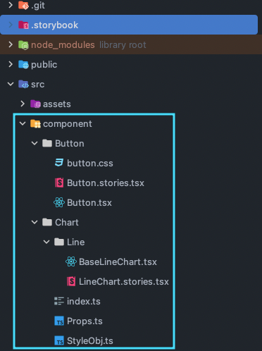
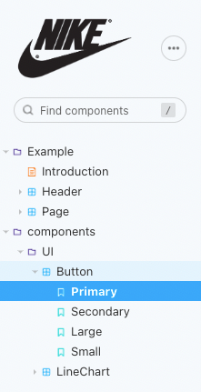
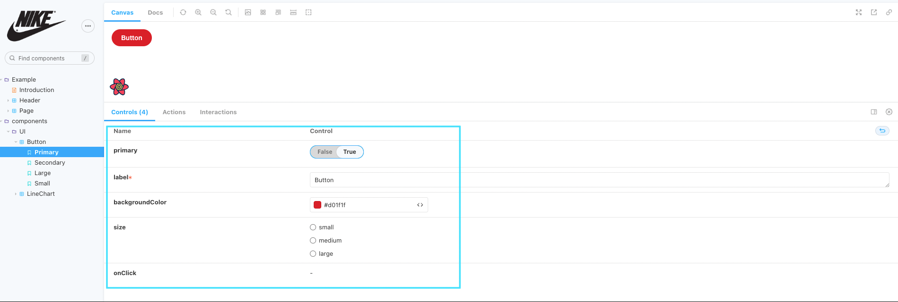

## 스토리북 메뉴추가 하기
스토리북에 화면 좌측 리스트에 컴포넌트를 추가 하려면 스토리구성요소 파일을 생성 해야합니다.

> `Button.stories.js | ts | jsx | tsx | mdx`
>

여러가지 구성요소로 작성방법들이 있지만 여기에서는 제일 흔하게? 자주 사용되는 `Component Story Format (CSF)` CSF 방식으로 작성을 하겠습니다.

스토리북 파일 구조는 프로젝트에 맞도록 지정을 합니다. 여기서는 component 디렉토리에 stories 파일을 추가 하겠습니다.


리액트 Button 컴포넌트를 하나 작성합니다.

```jsx
import React from 'react';
import './button.css';

interface ButtonProps {
  /**
   * Is this the principal call to action on the page?
   */
  primary?: boolean;
  /**
   * What background color to use
   */
  backgroundColor?: string;
  /**
   * How large should the button be?
   */
  size?: 'small' | 'medium' | 'large';
  /**
   * Button contents
   */
  label: string;
  /**
   * Optional click handler
   */
  onClick?: () => void;
}

/**
 * Primary UI component for user interaction
 */
export const Button = ({
  primary = false,
  size = 'medium',
  backgroundColor,
  label,
  ...props
}: ButtonProps) => {
  const mode = primary ? 'storybook-button--primary' : 'storybook-button--secondary';
  return (
    <button
      type="button"
      className={['storybook-button', `storybook-button--${size}`, mode].join(' ')}
      style={{ backgroundColor }}
      {...props}
    >
      {label}
    </button>
  );
};
```
### stories.* 파일 생성 및 관리
버튼 컴포넌트를 Button.stories.tsx파일에 추가 합니다.

```jsx
import React from 'react';
import { ComponentStory, ComponentMeta } from '@storybook/react';

import { Button } from './Button';

export default {
  title: 'Example/Button',
  component: Button,
  argTypes: {
    backgroundColor: { control: 'color' },
  },
} as ComponentMeta<typeof Button>;

const Template: ComponentStory<typeof Button> = (args) => <Button {...args} />;

export const Primary = Template.bind({});
Primary.args = {
  primary: true,
  label: 'Button',
};

export const Secondary = Template.bind({});
Secondary.args = {
  size: 'large',
  label: 'Button',
};

export const Large = Template.bind({});
Large.args = {
  size: 'small',
  label: 'Button',
};

export const Small = Template.bind({});
Small.args = {
  size: 'large',
  label: 'Button',
};
```

export default는 `component`자체, 구성요소 `title`가 표시될 위치 좌측 메뉴리스트, 메타데이터를 정의합니다. 각 개별 스토리 데코레이터, 파라미터 설정도 정의 합니다.

Button.stories.tsx 코드를 분석

```jsx
export default {
  title: 'Example/Button',
  component: Button,
  argTypes: {
    backgroundColor: { control: 'color' },
  },
} as ComponentMeta<typeof Button>;
```

`ComponentMeta` 타입으로 Button stories를 등록한다.

`title` 값은 고유해야 합니다

예를 들어서 Title에 값이 Components/UI/Button이면 메뉴 구조가 이미지 처럼 만들어지게 됩니다.




Primary, Secondary, Large, Small은 스토리북 canvas에 그려지는 컴포넌트 입니다.

`component`  는 리액트로 개발한 컴포넌트 or 캔버스영역에 렌더링하고 싶은 컴포넌트를 넣어 줍니다.

`argTypes` 는 스토리북에서 사용되는 각종 값을 설정이 가능하다. preview.js 파일에서 글로벌하게 설정도 가능하지만 개별 스토리에서도 argTypes을 설정해서 설정도 가능하다.

```jsx
const Template: ComponentStory<typeof Button> = (args) => <Button {...args} />;
```

Template은 스토리북 canvas에 실제로 렌더링 되는 컴포넌트 입니다. Template 하나로 args 값을 바꿔 가면서 Primary, Secondary, Large, Small  args 값 별로 생성이 가능 합니다.

```jsx
export const Primary = Template.bind({});
Primary.args = {
  primary: true,
  label: 'Button',
};

export const Secondary = Template.bind({});
Secondary.args = {
  size: 'large',
  label: 'Button',
};

export const Large = Template.bind({});
Large.args = {
  size: 'small',
  label: 'Button',
};

export const Small = Template.bind({});
Small.args = {
  size: 'large',
  label: 'Button',
};
```

`Template.bind({})` 값을 export 내보내면 스토리북 리스트에 스토리 메뉴들이 생성이 됩니다. 실제 컴포넌트가 제일 하위 계층이라고 보면 됩니다.

args 값을 지정하여 props 값을 내려주게 되고 args값이 컴포넌트에 적용이 됩니다.

### storybook Controls tab
스토리북 하단에 Controls Tab에서 컨버스에 렌더링된 스토리(컴포넌트)를 args값을 변경 하면서 확인이 가능 합니다.




### 참조
- https://storybook.js.org/docs/react/get-started/introduction
