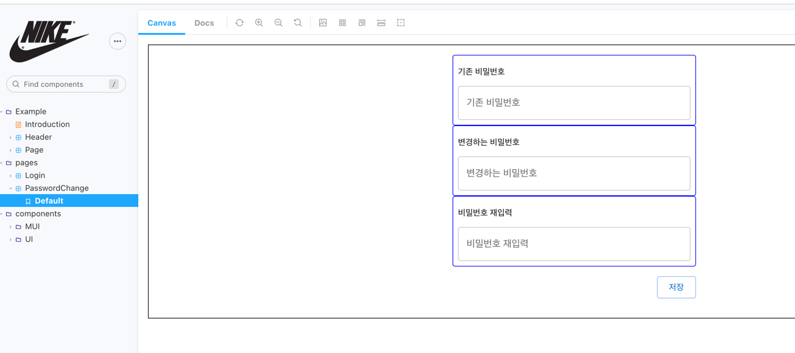
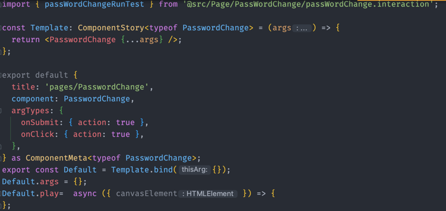
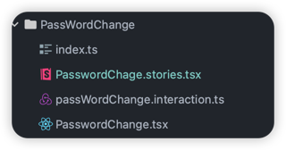
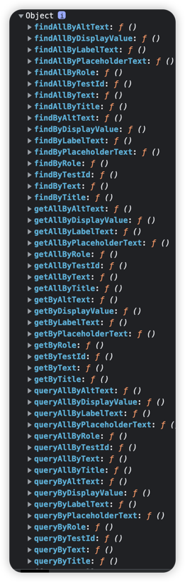
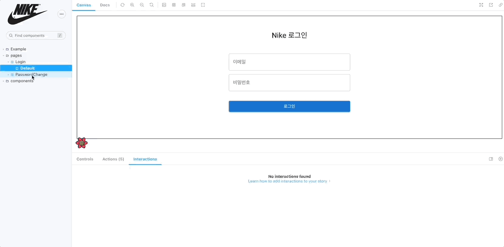
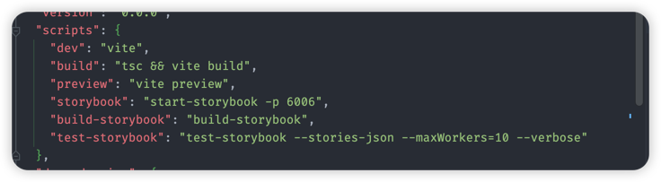
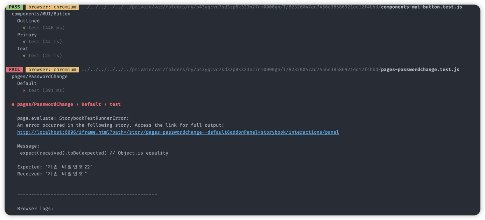

## Storybook Interaction 테스트
스토리북에서 작성한 컴포넌트 및 page를 [Interaction](https://storybook.js.org/docs/react/essentials/interactions) [addon](https://storybook.js.org/addons/@storybook/addon-interactions/)을 설치하여 기능을 
추가할 수 있습니다.

스토리에 대한 상호작용 테스트는 Jest기반으로 실행이 되며, UI가 어떤식으로 변화하는지 단계 별로 재생을 하면서
디버깅을 할 수 있습니다. 스토리에 대한 변경/추가 사항 및 리팩토링을 하게 되면, 상호작용 테스트 결과를
보면서 빠르게 작업이 가능합니다.


## interaction addon 설치
아래 패키지를 설치 합니다.
```yarn
yarn add -D @storybook/addon-interactions @storybook/jest @storybook/test-runner @testing-library/dom
```

스토리북 환경에 addon 추가 및 interaction 설정을 추가 합니다.
.stroybook/main.js
```javascript
module.exports = {
  ...,
  addons: [
    '@storybook/addon-interactions',
  ], 
  features: {
    interactionsDebugger: true,
    buildStoriesJson: true,
  }
```
- @storybook/addon-interactions 애드온 추가
- interactionsDebugger 옵션 true
- buildStoriesJson Json 형태로 필드 옵션 true


.stroybook/preview.js
```javascript
module.exports = {
    import { configure } from '@testing-library/dom';
    configure({ testIdAttribute: 'story-id' });
  ...
```
configure 옵션은 testId에 속성 값을 변경이 가능하다. 만약 설정을 하지 않는 경우에는 기본 Default 속성은 
`test-id`로 jest 명령어를 통해 검색이 되며, 만약 다른 test-id로 변경하고 싶다면 위와 같은 설정을 통해서
`story-id`으로 변경이 가능합니다. (getByTestId 함수 id 값)


## interaction 예시


비밀번호를 변경하는 스토리에 대한 interaction 테스트를 작성 한다고 하곘습니다.

### 어떤 테스트를 작성할것 인지 먼저 고민을 한다.

Case 1
  기존 비밀번호를 잘못 입력 한 경우

Case 2
  변경하는 비밀번호 필드, 비밀번호 재입력 필드 2개가 다르게 입력 된 경우

Case 3
  정상적으로 변경이 완료 된 경우

더 많은 케이스들이 있지만, 여기서는 3가지 케이스에 대하여 interaction 테스트를 작성 하겠습니다.


### interaction Test Code

제일 마지막 라인에 play 함수를 만들어서 interaction 테스트 코드를 작성을 하면 됩니다.
저는 play 함수를 따로 파일로 빼서 작성을 하겠습니다.


`passWordChange.interaction.ts` 파일을 생성 합니다.

```javascript
export function passWordChangeRunTest(story: ComponentStory<typeof PasswordChange>) {
  story.play = async ({args, canvasElement}) => {
    // 테스트 코드 입력
  }
}
```

play 아래에 위에서 작성한 테스트 케이스를 작성을 합니다.
`args`는 스토리파일에서 사용되는 args 값을 받아서 사용 가능하며, canvasElement는 스토리가 렌더링 되는 
dom Element 입니

interaction에서 사용되는 테스팅 라이브러리를 사용해서 테스트 코드를 작성 합니다.
기본적으로 스토리북에서는 users-event API를 제공 하고 있습니다. [users-event API](https://storybook.js.org/docs/react/writing-tests/interaction-testing#api-for-user-events)

<b>passwordChange.tsx 일부 코드</b>
```javascript
 <Grid container>
            <Grid item xs={12}>
              <Box_2>
                <Typography story-id={'before_pw'} py={1} variant={'subtitle2'}>
                  기존 비밀번호
                </Typography>
                <TextField
                  id={'ps_field'}
                  inputProps={{
                    'story-id': 'ps_field',
                  }}
                  size={'medium'}
                  name={'beforePassWord'}
                  label={'기존 비밀번호'}
                  type={'password'}
                  fullWidth
                  sx={{ marginTop: '4px' }}
                />
              </Box_2>
            </Grid>
            <Grid item xs={12}>
              <Box_2>
                <Typography story-id={'change_pw'} py={1} variant={'subtitle2'}>
                  변경하는 비밀번호
                </Typography>
                <TextField
                  id={'cps_field'}
                  inputProps={{
                    'story-id': 'cps_field',
                  }}
                  size={'medium'}
                  name={'changePassWord'}
                  label={'변경하는 비밀번호'}
                  type={'password'}
                  fullWidth
                  sx={{ marginTop: '4px' }}
                />
              </Box_2>
            </Grid>
            <Grid item xs={12}>
              <Box_2>
                <Typography story-id={'change_pw2'} py={1} variant={'subtitle2'}>
                  비밀번호 재입력
                </Typography>
                <TextField
                  id={'cps_field2'}
                  inputProps={{
                    'story-id': 'cps_field2',
                  }}
                  size={'medium'}
                  name={'rePassWord'}
                  label={'비밀번호 재입력'}
                  type={'password'}
                  fullWidth
                  sx={{ marginTop: '4px' }}
                />
              </Box_2>
            </Grid>
            <Grid item xs={12} py={2}>
              <Stack direction={'row'} justifyContent={'flex-end'}>
                <Button
                  story-id={'save_button'}
                  type={'submit'}
                  size={'medium'}
                  color={'primary'}
                  variant={'outlined'}
                >
                  저장
                </Button>
              </Stack>
            </Grid>
          </Grid>
```
 해당코드에서 위에서 설정한 story-id 속성을 보면 됩니다.( 만약 config 설정을 하지 않았다면, test-id가 기본 속성 값 입니다.)
아래 테스트 코드에서 story-id 값을 통해서 테스트를 하는 component 정보를 가져오게 됩니다.


#### Case1 코드
```javascript
async ({ args, canvasElement }) => {
  // Starts querying the component from its root element
  const canvas = within(canvasElement);
  const before_pw_title = canvas.getByTestId('before_pw');
  const change_pw_title = canvas.getByTestId('change_pw');
  const change_pw2_title = canvas.getByTestId('change_pw2');
  // 타이틀 확인
  expect(before_pw_title.textContent).toBe('기존 비밀번호');
  expect(change_pw_title.textContent).toBe('변경하는 비밀번호');
  expect(change_pw2_title.textContent).toBe('비밀번호 재입력');

  // 비밀번호 입력
  await userEvent.type(canvas.getByTestId('ps_field'), '기존 비밀번호 입력2', {
    delay: 30,
  });
  await userEvent.type(canvas.getByTestId('cps_field'), '변경 비밀번호 입력', {
    delay: 30,
  });
  await userEvent.type(canvas.getByTestId('cps_field2'), '변경 비밀번호 입력', {
    delay: 30,
  });
  // 저장 버튼 실행
  const save_button = canvas.getByTestId('save_button');
  await userEvent.click(save_button);
  await expect(args.onClick).toHaveBeenCalled();

  // case1 기존 비밀번호 오입력 체크
  const dialogDom = document.querySelector("[role='presentation']")
  as
  HTMLElement;
  const dialogCanvas = within(dialogDom);

  const alert_msg = dialogCanvas.getByTestId('alert_msg');
  const alert_close = dialogCanvas.getByTestId('dialog_close');
  await expect(alert_msg.textContent).toBe(PASSWORD_MSG['PASSWORD_ERROR'].content);
  await userEvent.click(alert_close);
}
```
user-event에 `within`를 사용해서 dom 요소를 가져와서 query 함수를 바인딩 시켜줍니다. 


- `within(canvasElement)` 스토리영역에 dom 요소를 가져옵니다.
- `getByTestId(id)`를 통해 story-id와 일치하는 dom 요소를 선택합니다. 
- `toBe`를 통해 title이 일치하는지 테스트 합니다.
- user-api `type`를 사용 하여 input에 text 값을 입력 합니다. 
- 속성값으로 delay: 30 주어 타이밍하는 느낌으로 입력 되도록 설정 합니다.
- `save_button` button을 click하여 저장 이벤트를 발생 시킵니다.
- `toHaveBeenCalled` 버튼 이벤트가 호출 됬는지 확인 합니다.
- dialog는 스토리 dom 영역이 아닌 body 영역에서 dom 생성이 되어 document에서 querySelector를 통해 dom
을 선택 합니다.
- `within(dialogDom)`를 사용하여 dialog dom 요소를 가져와서 query 함수를 바인딩 합니다.
- `getByTestId(id)`를 통하여 alert msg 정보를 가져와서 내가 원하는 메시지랑 일치하는지 확인 합니다.
- alert close 버튼을 클릭하여 dialog 메시지를 close 합니다.

여기까지가 Case1에 대한 간단한 테스트 입니다.

이후 위에서 작성한 Case2, Case3을 테스트 해서 진행하면 아래와 같은 코드가 생성이 됩니다.

```javascript
    story.play = async ({ args, canvasElement }) => {
  // Starts querying the component from its root element
  const canvas = within(canvasElement);
  console.log(canvas);
  const before_pw_title = canvas.getByTestId('before_pw');
  const change_pw_title = canvas.getByTestId('change_pw');
  const change_pw2_title = canvas.getByTestId('change_pw2');
  // 타이틀 확인
  expect(before_pw_title.textContent).toBe('기존 비밀번호');
  expect(change_pw_title.textContent).toBe('변경하는 비밀번호');
  expect(change_pw2_title.textContent).toBe('비밀번호 재입력');

  // 비밀번호 입력
  await userEvent.type(canvas.getByTestId('ps_field'), '기존 비밀번호 입력2', {
    delay: 30,
  });
  await userEvent.type(canvas.getByTestId('cps_field'), '변경 비밀번호 입력', {
    delay: 30,
  });
  await userEvent.type(canvas.getByTestId('cps_field2'), '변경 비밀번호 입력', {
    delay: 30,
  });
  // 저장 버튼 실행
  const save_button = canvas.getByTestId('save_button');
  await userEvent.click(save_button);
  await expect(args.onClick).toHaveBeenCalled();

  // case1 기존 비밀번호 오입력 체크
  const dialogDom = document.querySelector("[role='presentation']") as HTMLElement;
  const dialogCanvas = within(dialogDom);

  const alert_msg = dialogCanvas.getByTestId('alert_msg');
  const alert_close = dialogCanvas.getByTestId('dialog_close');
  await expect(alert_msg.textContent).toBe(PASSWORD_MSG['PASSWORD_ERROR'].content);
  await userEvent.click(alert_close);

  // 필드 초기화
  await userEvent.clear(canvas.getByTestId('ps_field'));
  await userEvent.clear(canvas.getByTestId('cps_field'));
  await userEvent.clear(canvas.getByTestId('cps_field2'));

  // 변경 비밀번호 필드 입력
  await userEvent.type(canvas.getByTestId('ps_field'), '기존 비밀번호 입력', {
    delay: 30,
  });
  await userEvent.type(canvas.getByTestId('cps_field'), '변경 비밀번호 입력2', {
    delay: 30,
  });
  await userEvent.type(canvas.getByTestId('cps_field2'), '변경 비밀번호 입력', {
    delay: 30,
  });
  // 저장 버튼 실행
  await userEvent.click(save_button);
  // case2 변경하는 비밀번호 오입력 체크
  const dialogDom2 = document.querySelector("[role='presentation']") as HTMLElement;
  const dialogCanvas2 = within(dialogDom2);
  const alert_msg2 = dialogCanvas2.getByTestId('alert_msg');

  console.log(alert_msg2.textContent, PASSWORD_MSG['NEW_PASSWORD_CHECK'].content);
  await expect(alert_msg2.textContent).toBe(PASSWORD_MSG['NEW_PASSWORD_CHECK'].content);
  const alert_close2 = dialogCanvas2.getByTestId('dialog_close');
  await userEvent.click(alert_close2);

  // 정상 처리
  await userEvent.clear(canvas.getByTestId('ps_field'));
  await userEvent.clear(canvas.getByTestId('cps_field'));
  await userEvent.clear(canvas.getByTestId('cps_field2'));

  await userEvent.type(canvas.getByTestId('ps_field'), '기존 비밀번호 입력', {
    delay: 30,
  });
  await userEvent.type(canvas.getByTestId('cps_field'), '변경 비밀번호 입력', {
    delay: 30,
  });
  await userEvent.type(canvas.getByTestId('cps_field2'), '변경 비밀번호 입력', {
    delay: 30,
  });
  // 저장 버튼 실행
  await userEvent.click(save_button);

  // 비밀번호 변경 정상 처리
  const dialogDom3 = document.querySelector("[role='presentation']") as HTMLElement;
  const dialogCanvas3 = within(dialogDom3);
  const alert_msg3 = dialogCanvas3.getByTestId('alert_msg');

  console.log(alert_msg3.textContent, PASSWORD_MSG['PASSWORD_SAVE'].content);
  await expect(alert_msg3.textContent).toBe(PASSWORD_MSG['PASSWORD_SAVE'].content);

  const alert_close3 = dialogCanvas3.getByTestId('dialog_close');
  await userEvent.click(alert_close3);
};

return story;
```

이제 스토리북에서 실행되는 interaction play를 보게되면 아래와 같습니다.


### test watch 실행


script에 test-torybook 명령어를 통해서 테스트를 실행 할 수 있습니다.
기본으로는 스토리 args 값에 대한 테스트가 돌아가고 interaction 테스트에 expect가 깨지면 에러를 발생 시킵니다.
>  yarn test-storybook --watchAll

명령어를 실행하여 파일을 저장할때 테스트를 수행 합니다.

아까 작성한 interaction 테스트를 꺠지게 만들고 실행하게 되면 아래와 같은 메시지가 출력이 됩니다.


### 참조
- https://storybook.js.org/docs/react/writing-tests/introduction
- https://storybook.js.org/docs/react/writing-tests/test-runner
- https://storybook.js.org/docs/react/writing-tests/interaction-testing
