## chromatic 이란?
>크로메틱 공식 홈페이지([chromatic](https://www.chromatic.com/))에 많은 기능과 내용이 있습니다.

스토리북으로 컴포넌트를 관리하고 테스트를 넣었다면, 크로메틱으로 시각화 테스트 및 협업 도구로 사용하기 좋습니다.
#### 내가 사용한 기능
1. 디자이너, 기획자, 등등 다른 사람과 헙업시 chromatic 도메인에 초대를 해서 컴포넌트 별로 코멘트를 작성이 가능하며, 공유가 가능합니다. 
2. github gitAction CI/CD에 크로메틱을 연동하여 PR Merge 하기전에 내가 스타일 수정을 하면서 변경된 사항들을 git CheckList를 통해서 검증이 가능합니다.
3. 컴포넌트 위치 및 스타일이 변경된 부분을 시각화하여 보여주기 때문에 배포하기 이전에 내가 수정한 부분이 어떤 컴포넌트,페이지 등등에 영향이 가는지 확인이 가능합니다.


### chromatic 환경 구성하기 (cli)

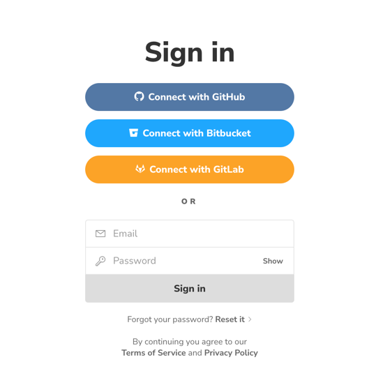

1. [chromatic start](https://www.chromatic.com/start) 링크로 접속 하여 회원가입을 진행 합니다.

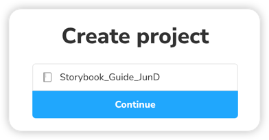
2. Project를 생성 합니다.
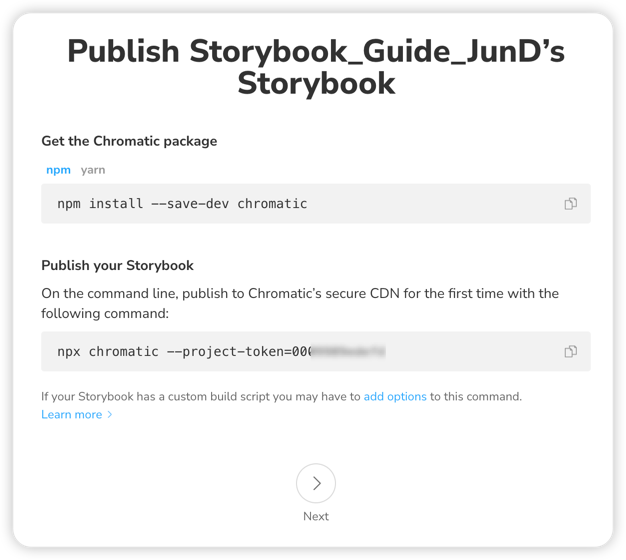
3. `npm` or `yarn` 명령어를 통해 chromatic 설치 합니다.
> npx chromatic --project-token=000*****
 
`project-token` 토큰 값은 외부에 노출 하지 않도록 주의 합시다.

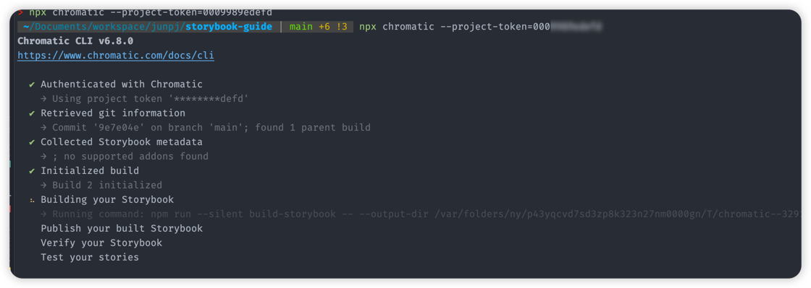
스토리북이 구성된 Repo에서 명령어를 입력하여 구성된 스토리북을 chromatic에 배포를 합니다.

정상적으로 빌드 및 배포가 되면 다시 chromatic URL에 접근하면 아래와 같은 화면이 나타나게 됩니다.

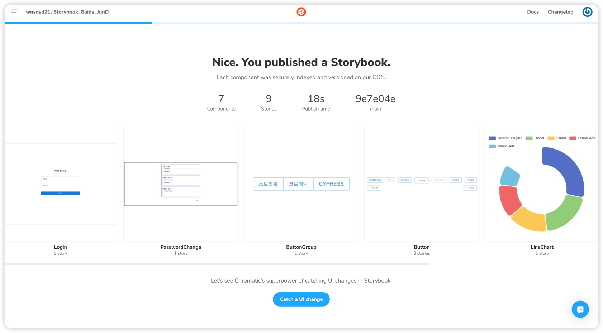

컴포넌트 스타일을 변경하고 chromatic 재배포를 하고 다시 chromatic에 접속 하면 변경된 컴포넌트
리스트가 나오게 됩니다.

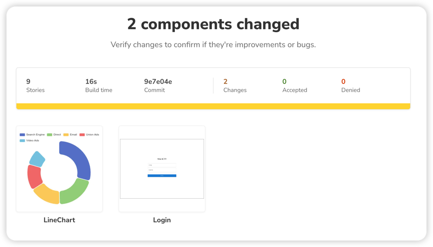
변경이 발생한 LineChart 컴포넌트와 Login Page 컴포넌트가 리스트에 나타나게 됩니다.

### chromatic Page 살펴보기
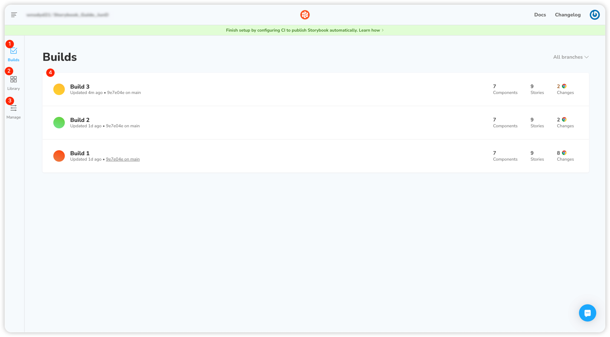

1. builds 메뉴는 stroybook에서 chromatic build 내역 리스트를 보여줍니다. 총 3번에 빌드를 진행했습니다.
   2. Build1 빌드 실패한 상태 입니다.
   3. Build2 정상적으로 배포가 완료된 상태 입니다.
   4. build3 정상적으로 배포가 됬지만, 이전 컴포넌트와 배포한 컴포넌트의 변경사항이 있어서 경고 상태입니다.
2. Library 메뉴는 스토리북에서 관리되고 있는 스토리 목록을 볼 수 있습니다.
3. Manage 메뉴는 협업하는 사람들을 초대하거나, 슬렉 웹훅을 연동 하거나, config 설정하는 메뉴 입니다.

### chromatic 변경점 시각화

chromatic 제일 자주쓰는 변경점을 시각화를 해서 보여주는 기능입니다. 
공통으로 쓰는 Box 컴포넌트에 border 값을 지워보겠습니다.
-> chromatic에서 영향이 미치는 컴포넌트를 체크해서 보여주게 됩니다.

```javascript
const Box_2 = (props: PropsWithChildren) => {
   return (
           <Box
                   p={1}
                   sx={{
                      border: '1px solid blue',
                      borderRadius: '4px',
                   }}
           >
              {props.children}
           </Box>
   );
};

```
border 값을 제거 하겠습니다.
```javascript
const Box_2 = (props: PropsWithChildren) => {
   return (
           <Box p={1}>
              {props.children}
           </Box>
   );
};
```
다시 chromatic build를 하겠습니다.

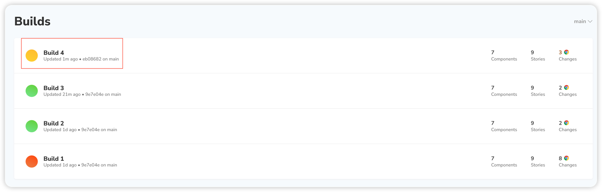
build4로 변경이 완료 되었고, 컴포넌트 변경사항이 없는 경우 초록불이지만, 변경이 있어 노란색으로 표시가 되었습니다.
build4에 내역을 보게되면 

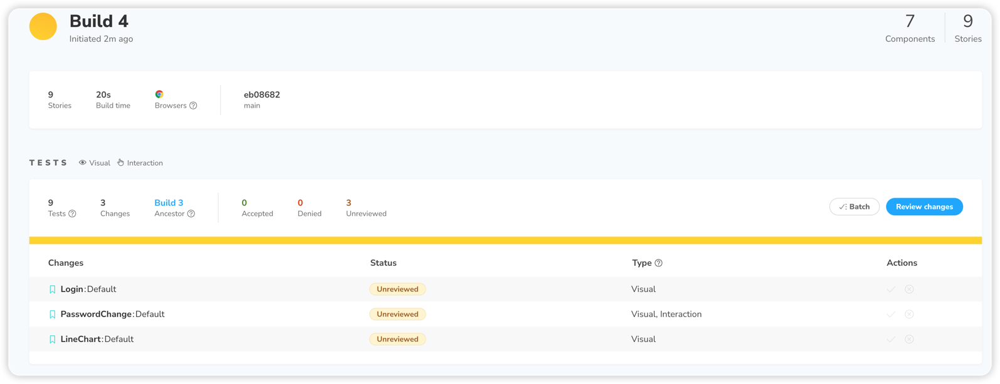
총 3개의 스토리가 변경된걸 확인 할 수 있습니다. (LineChart는 랜덤데이터를 넣어놔서 매번 빌드시 데이터가 다르기 떄문에 표시가 되었습니다.😂)
 
PassWordChange를 클릭 하게 되면 아래와 같은 이미지가 나타납니다.
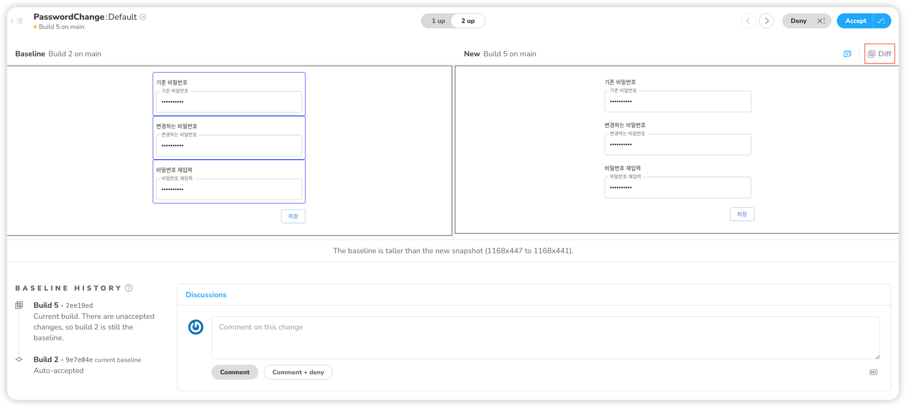
좌측이 기존 스토리 / 우측이 변경된 스토리 입니다.

변경사항이 의도에 맞는다면 우측 상당에 Accept를 눌러 확인 처리를 진행하면 됩니다.

만약 변경점이 잘 안보이면 우측 상단에 diff 클릭하게 되면
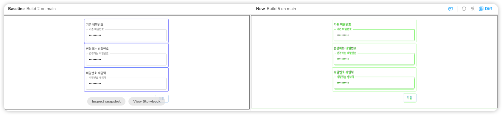
스타일이 변경된 지점에 초록색 mark가 표시가 됩니다 .

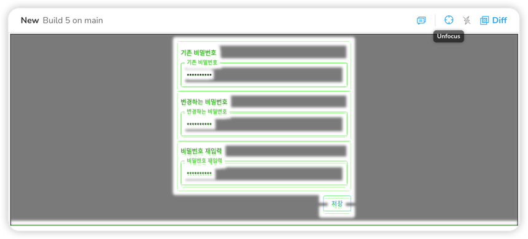
또 우측 상단에 focus 벼튼을 클릭 하면 변경된 부분만 포스커 되어 보여지게 됩니다.

지금은 에시로 2개 스토리에 영향이 미쳤지만, 만약에 디자인 시스템을 구축하고
스토리가 100개 이상 늘어나게 됬을 때 더 큰효과가 발생하게 됩니다. 하나의 공통 컴포넌트의 변경으로
어떤 스토리가 영향을 미치는지 확인이 가능하며, 또 comment를 남겨서 기획자나 디자이너에게 확인을
해달라는 요청도 보낼 수 있습니다.


> chromatic 무료버전은 매달 5000개 스냅샷 까지는 무료이며, 그이후는 스냅샷을 제공하지 않아서 다음달 까지
> 기다리거나... 유용하게 사용하고 있다면 결제해서 사용해도 좋을듯 합니다.

### gitAction chromatic 연동 하기 (CI/CD)

### chromatic 알람 Slack 채널 webhooks을 통해 전달 받기(번외)


### 참조
- https://www.chromatic.com
- https://github.com/chromaui/chromatic-cli
- https://github.com/marketplace/actions/publish-to-chromatic
- https://www.chromatic.com/docs/test
