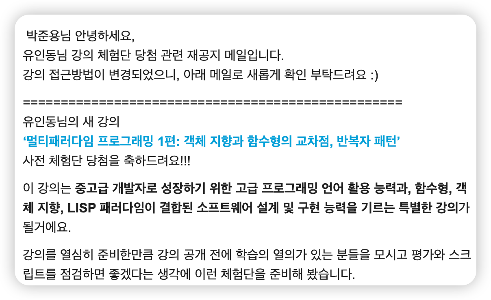

# 멀티패러다임 프로그래밍 강의 후기 ✨

## 소개

인프런에서 유인동 강사님의 '멀티패러다임 프로그래밍 1편: 객체 지향과 함수형의 교차점, 반복자 패턴' 강의를 수강하게 되었습니다. 강의 체험단으로 당첨되어 좋은 기회를 얻게 되었고, 이전에도 개발자 컨퍼런스와 유튜브 라이브, 다른 강의들을 통해 강사님의 내용을 접해본 경험이 있어 기대가 컸습니다.

## TL;DR 🎯

객체 지향, 함수형, 절차적 등 다양한 프로그래밍 패러다임을 사용해왔지만, 각 패러다임의 차이나 사용을 충분히 활용하지 못하고 있다는 느낌을 받았습니다. 이번에 출시한 멀티패러다임 강의는 단순히 특정 개발 스타일이나 방식에 대한 이야기가 아니었습니다. 패러다임을 바라보는 관점 자체를 변화시켜 주었습니다. 특히 지연 평가(lazy evaluation), iterable, iterator, generator와 같은 개념들을 이론뿐 아니라 실제 활용 관점에서 더 깊이 있게 이해할 수 있었고, 이러한 개념들을 실무에 어떻게 적용할 수 있을지 구체적으로 고민해보는 계기가 되었습니다.

## 강의 내용 요약 📚

### 1. 멀티패러다임 프로그래밍이란?
- 다양한 프로그래밍 패러다임의 이해
- 패러다임 간 교차점과 상호 보완성

### 2. Iteration Protocol(이터레이션 프로토콜)
- 이터레이션 프로토콜의 개념과 중요성
- 다양한 언어에서의 구현 방식 비교(클로저, 코틀린, Typescript)

### 3. 이터러블(Iterable)과 이터레이터(Iterator)
- 이터러블과 이터레이터의 정의
- 명령형, 객체지향, 함수형에서의 구현 방식

### 4. 제네레이터(Generator)
- 제네레이터의 개념과 활용
- 지연 평가(Lazy Evaluation)와의 관계

### 5. 실무 적용 사례
- 다양한 패러다임을 활용한 코드 작성
- 성능 최적화와 가독성 향상 기법

### 이터레이션 프로토콜의 특징 🔄

이터레이션 프로토콜은 다양한 패러다임을핵심 개념으로, 다음과 같은 특징을 가지고 있습니다:

- **범용성**: 객체지향, 함수형, 명령형 등 모든 패러다임에서 활용 가능한 유연한 개념입니다.
- **지연 평가**: 필요한 시점에 데이터를 생성함으로써 메모리 사용을 최적화합니다.
- **무한 시퀀스**: 무한한 데이터 스트림을 표현할 수 있는 능력을 제공합니다.
- **합성 가능성**: 여러 이터레이터를 조합하여 복잡한 데이터 처리 파이프라인 구축이 가능합니다.

강의에서 특히 인상 깊었던 점은 이 프로토콜이 단순한 API가 아닌, 다양한 패러다임 간 소통의 통로 역할을 한다는 것이었습니다. 특히 함수형과 객체지향의 장점을 모두 활용할 수 있는 방법을 제시해 주었습니다.

## 실무 적용 가능성 🛠️

이 강의의 내용은 실무에서 즉시 활용 가능한 방법들로 가득했습니다:

1. **대용량 데이터 처리**: 지연 평가를 활용한 메모리 효율적인 데이터 처리 방식
2. **UI 컴포넌트 설계**: 이터러블을 활용한 반응형 컴포넌트 구현
3. **API 응답 스트리밍**: 대용량 API 응답을 점진적으로 처리하는 방법
4. **코드 최적화**: 불필요한 계산을 줄이는 기법
5. **테스트 용이성**: 각 단계를 독립적으로 테스트할 수 있는 구조

실제로 강의에서 배운 개념들을 활용하여 프로젝트의 성능을 개선하고, 코드 가독성을 높일 수 있을 것으로 기대됩니다. 특히 대용량 데이터를 다루는 백엔드 시스템이나 사용자 인터랙션이 많은 프론트엔드 애플리케이션에서 유용하게 사용될 수 있을 것입니다.

## 결론 및 추천 👍

이 강의는 단순히 특정 기술이나 라이브러리를 배우는 강의가 아닌, 프로그래밍에 대한 사고 방식 자체를 확장시켜주는 귀중한 경험이었습니다. 특히 다음과 같은 분들에게 적극 추천합니다:

- 다양한 패러다임에 대해 깊이 있게 이해하고 싶은 개발자
- 코드의 효율성과 가독성을 동시에 높이고 싶은 분
- 대용량 데이터 처리에 관한 최적화 기법을 배우고 싶은 분
- 함수형과 객체지향 프로그래밍의 장점을 모두 활용하고 싶은 분
- 실무에서 즉시 적용 가능한 패턴을 찾고 있는 개발자

강의 난이도는 중급 이상이지만, 기본 개념부터 차근차근 설명해주시기 때문에 초심자도 충분히 따라갈 수 있습니다. 얻는 인사이트가 매우 큰 강의로, 프로그래밍 실력을 한 단계 높이고 싶은 개발자에게 추천합니다.

유인동 강사님의 자세한 설명과 실무적인 예제, 그리고 다양한 패러다임에 대한 통찰력이 돋보이는 강의였습니다. 앞으로 출시될 다음도 기대됩니다!

### reference

https://www.inflearn.com/course/multi-paradigm-programming/dashboard

https://github.com/marpple/multi-paradigm-programming
