## GitHub Action에 self host runner 셋팅하기

그 동안 GitHub Action 무료 버전 리소스 안에서 잘 사용하고 있었습니다.([Supported runners and hardware resources](https://docs.github.com/en/actions/using-github-hosted-runners/about-github-hosted-runners#supported-runners-and-hardware-resources)
) 
하지만 프로젝트가 점점 규모가 커지면서 gitHub Action 지원하는 runner 리소스로는 부족한 상황이 발생하기 시작했습니다.
storybook 스토리가 수백개가 만들어지고, Cypress E2E 테스트 시간이 점점 늘어나고, 빌드하면서 메모리 부족으로
빌드를 실패하고 그래서 git runners Docs를 보던중 `self-hosted runners`를 직접 셋팅하여 사용할 수 있다는 글을
보게되고 구축하기로 했습니다. 

내 로컬 PC runners를 설치하여 내 로컬PC 리소스를 사용하게 끔 지정해도 되지만 Azure VM 컨테이너를
하나 생성해서 셋팅을 하겠습니다.


## Azure VM 컨테이너 생성하기

> Azure 계정은 미리 가입 해주세요.
>
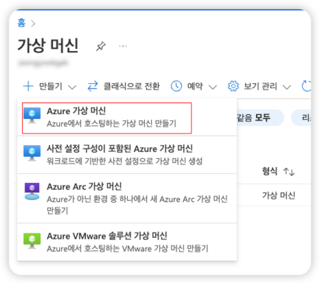

runners를 설치할 VM를 하나 추가 합니다.

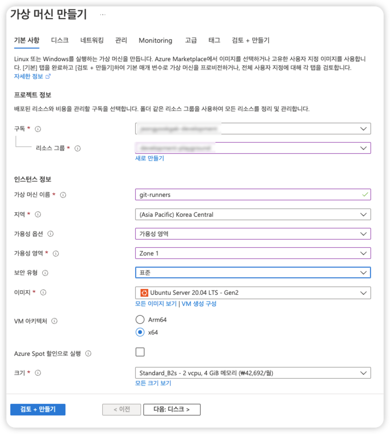
구독,리소스그룹,가상머신이름,지역,가용성영역,이미지,크기 필수 입력사항을 입력합니다.

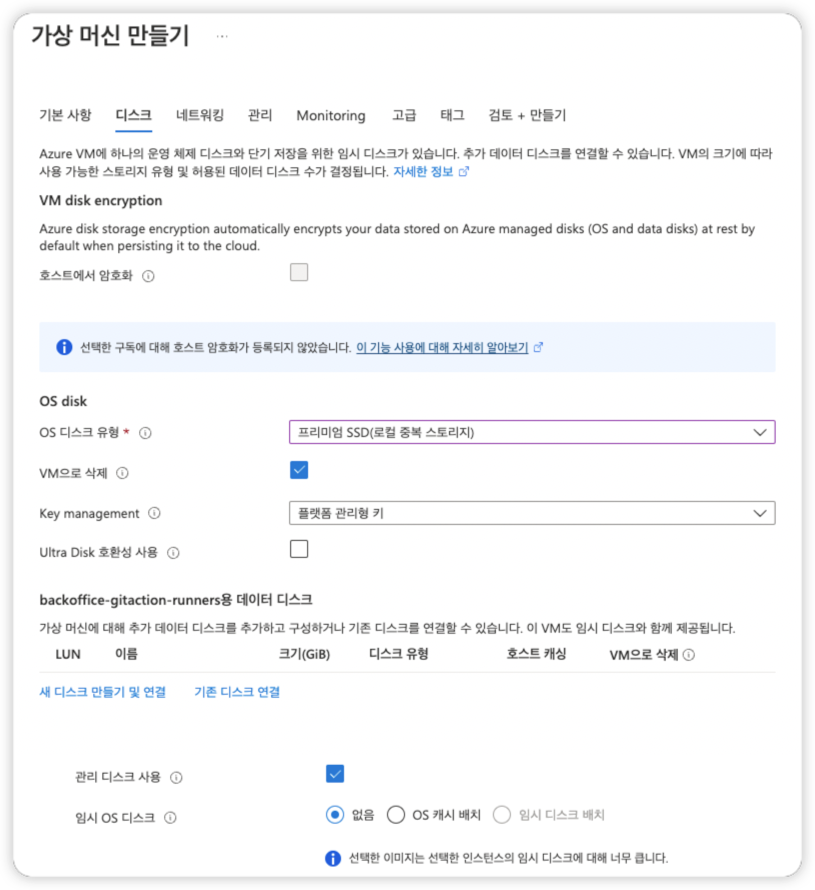
디스크 필수 입력사항을 입력 합니다.

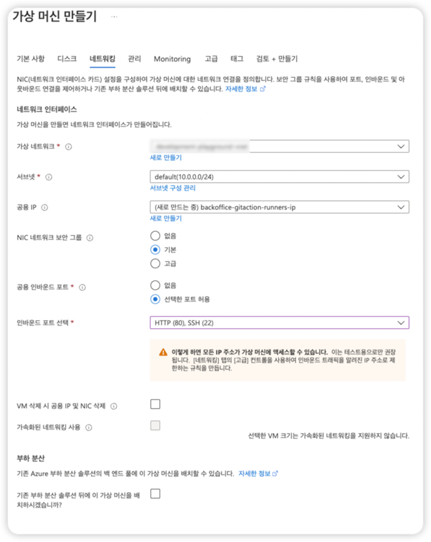
네트워크 탭에서는 22번 포트를 열어줘서 cli로 접속할 수 있도록 합니다.

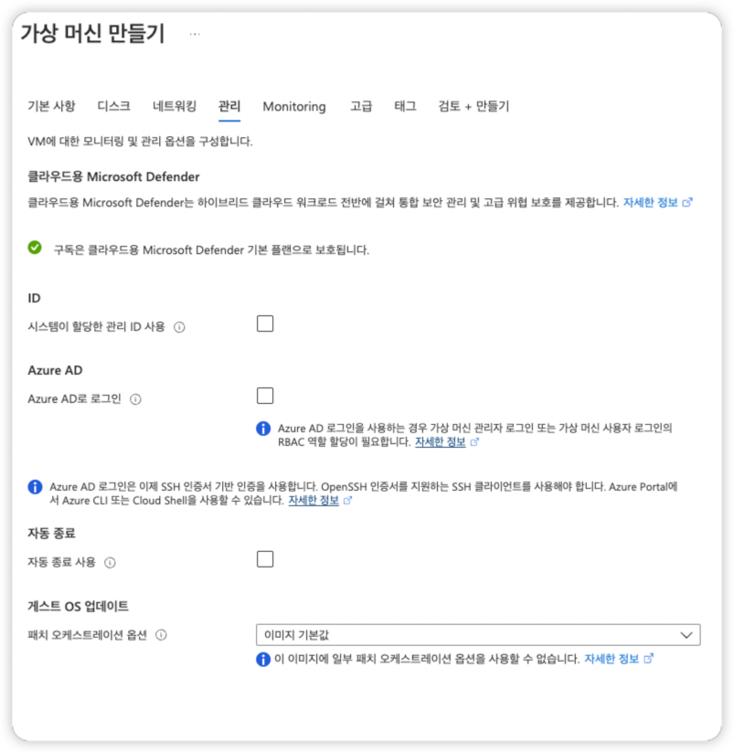
필요한 설정을 입력 합니다.

모니터링기능은 유료 설정이라 따로 셋팅하지 않았습니다.

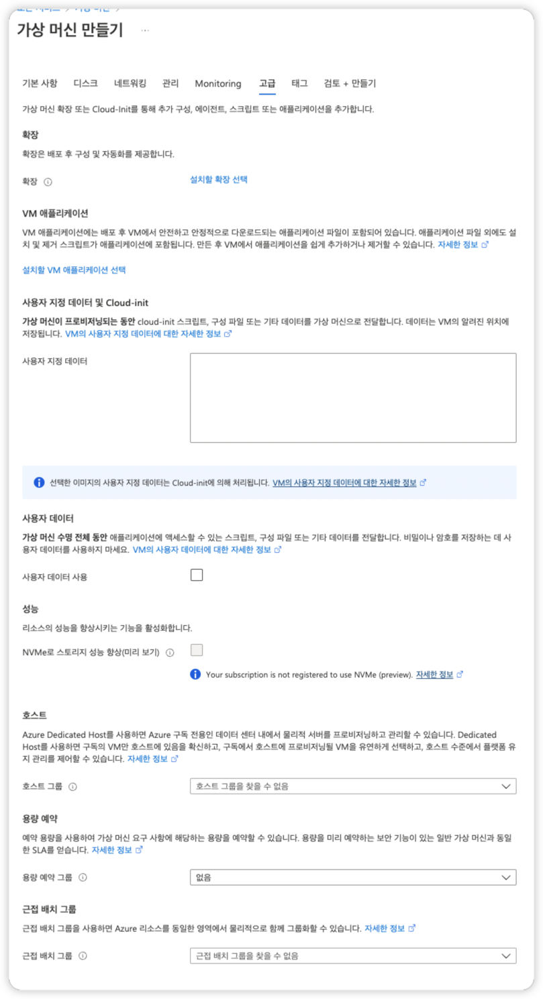
필요한 설정을 입력 합니다.

가상 머신이 정상정으로 만들어지면 내가 만든 가상머신이 화면에 나타나게 됩니다.

이제 Azure-cli 통해 제어하고 싶으면 따로 설치 합니다.
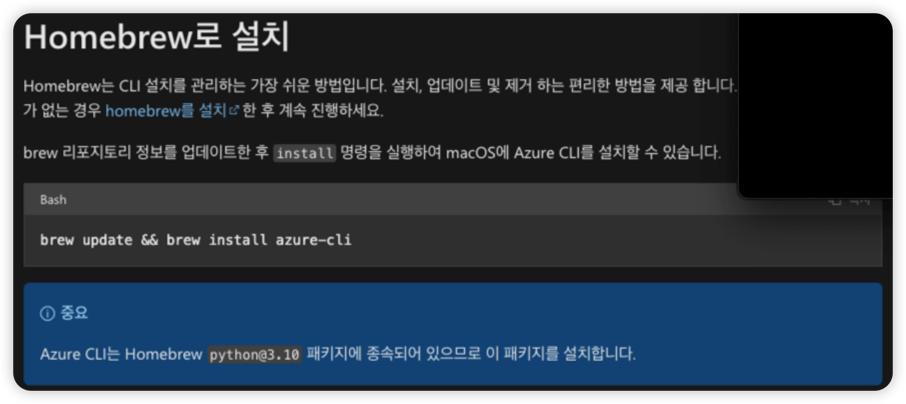

## SSH 접속
설치가 끝나면 azure계정@공인IP로 ssh 접속을 시도 합니다.

 
>만약 SSH 접속이 안된다면
> 
> The runners connect back to GitHub, no need for inbound firewall holes. (Outbound https 443 is all that’s needed.)
> azure vm에 네트워크 메뉴에서 아웃바운드 433 포트를 오픈 했는지 확인해주세요.)

## GitHub Action Runner install

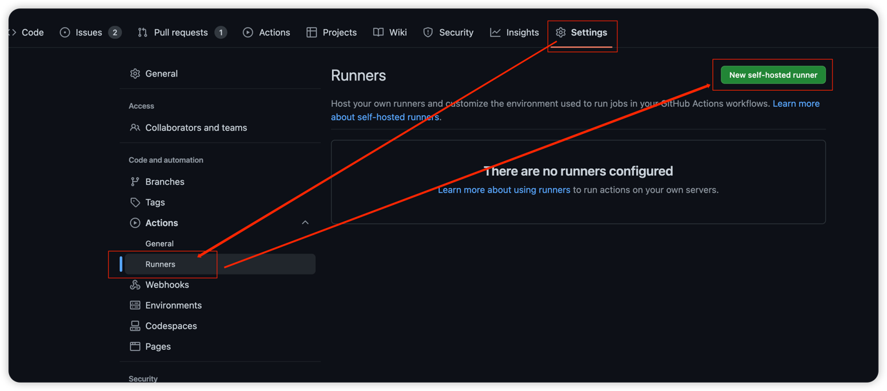
우측 버튼 self-host-runner 클릭 합니다.

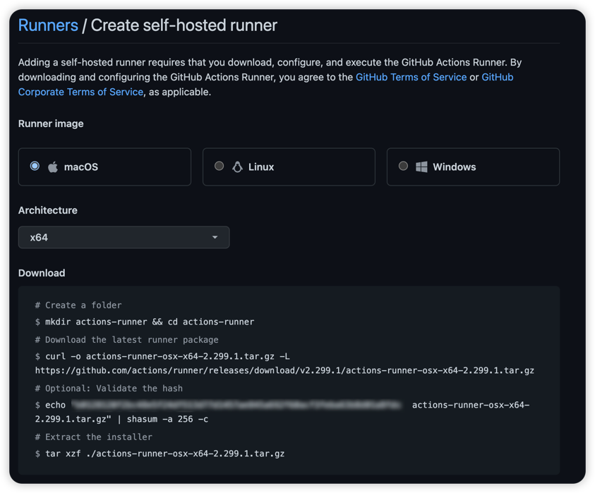
- Azure VM 만들 때 생성한 image를 선택한다. 저는 Ubuntu로 생성 했으니 Linux를 체크합니다.
- `Architecure`는 X64를 선택 합니다.
- ssh 접속한 상태에서 Download에 있는 명령어를 하나씩 입력 합니다.

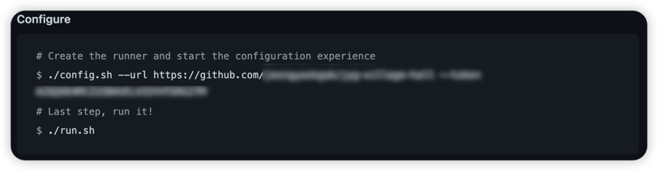
설정에 runner 셋팅을 하는 git repo 주소를 입력하고, git 접근가능한 token을 입력 합니다.
>./config.sh --url https://github.com/repo/runnerTest --token token정보

```shell
ls 명렁어
```
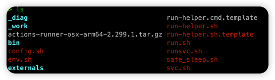

설치된 파일 리스트가 나오게 됩니다.
여기서 `run.sh` 명령어를 통해서 실행 합니다.
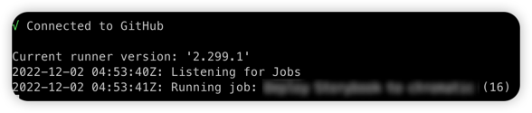

connected to GitHub를 통해 정상적으로 연결되었다고 확인이 가능합니다. 또 GitHub > Setting > action - runner
에서도 Idle 상태로 표시가 되면서 대기중인걸 확인할 수 있습니다.
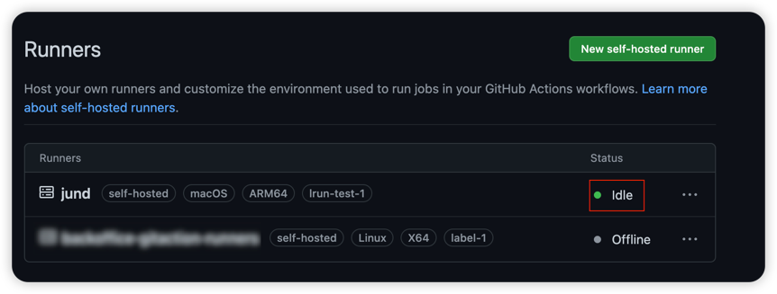


## GitHub Action workflow
이제 Wrokflow yaml 파일을 수정 합니다.


```yaml
jobs:
  pro-deployment:
    name: Deploy 
    runs-on: [ macos-12 ]
```
기존에는 runs-on에 무료로 사용가능한 runner 정보를 입력 했지만
 ```yaml
jobs:
  pro-deployment:
    name: Deploy
    runs-on: [self-hosted, Linux, X64 ,label-1]
```
`self-hosted` 을 셋팅하거나 self-host 설치하면서 추가한 tag 값을 입력 해주게 되면 
우선순위로 self-hosted가 연결이 되고 만약 연결이 되지 않는 경우 다른 name runner로 연결이 됩니다.

## 결론
Azure VM 리소스를 더 많이 사용하여, 메모리 부족현상 및 테스트 병렬처리 구성으로 속도는 증가 했지만,
단일 VM으로 항상 켜두고 작업하기에는 비용적으로 리스크가 있는 것 같다.
나중에는 Azure pipelines(Azure DevOps) 서비스를 이용하거나 [링크](https://learn.microsoft.com/ko-kr/azure/developer/github/github-actions)
쿠버네티스를 활용하여 효율적으로 관리하거나 작업이 더 필요할 것 같다. DevOps분이 시간이 남으면 한번 이야기를 해서 구축을 제안 해봐야겠습니다.😥

### 참조

- https://docs.github.com/en/actions/using-github-hosted-runners/about-github-hosted-runners#supported-runners-and-hardware-resources
- https://docs.github.com/en/actions/hosting-your-own-runners/about-self-hosted-runners
- https://learn.microsoft.com/ko-kr/azure/developer/github/github-actions
