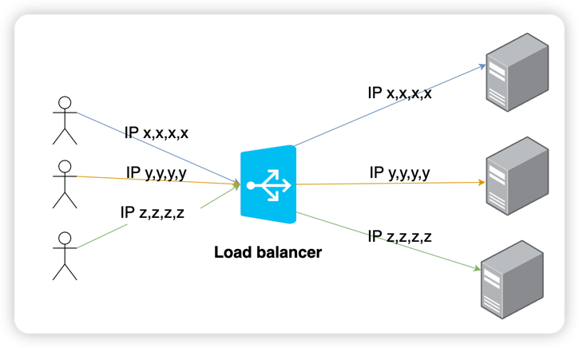
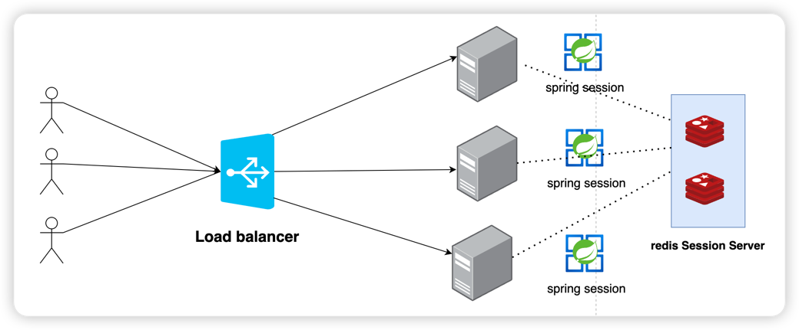
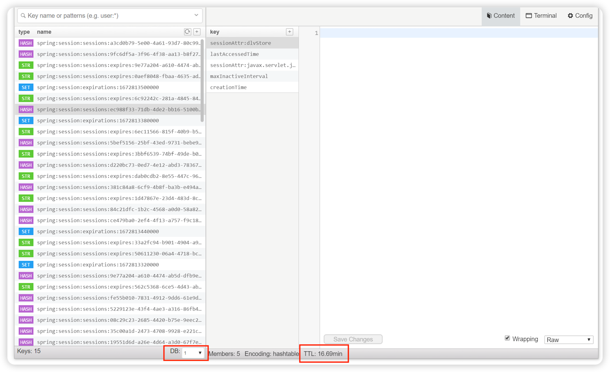

## Redis로 세션 관리하게 된 이유
레거시 쇼핑몰을 유지보수 하고 있던 사람이 계약 만료로 나가게 되면서 해결이 잘안되는 이슈를 하나 전달 받았다. CS팀에서 이용자들이 서비스를 잘 이용하다가 중간에 로그인이 끊어져서
다시 재로그인을 해야한다는 문의가 많이 유입된다고 했다. 그래서 쇼핑몰이 어떤식으로 인프라가 구성 되어 있고, 어떤 언어로 개발이 되어있는지 몰랐던 나는 히스토리에 대한 이야기를
듣게 되었다. 3~4년전에 SI 업체에서 구축한 이후로 소스코드로 기능 추가 정도만 했지, 관리가 되지 않고 있고, 레거시 코드가 덕지덕지 많이 있었고, 알 수 없는 환경, 작업하다 하지 않은 코드들
거기에 SVN 환경, 몇년동안 계속 땜빵 및 버그/기능 추가를 하다보니 소스는 엄청 거대 했다. 또 인프라 구성은 LB IP Hash 방식으로 한번 접속한 사용자는 계속 똑같은 WAS만 보게 되는 구성 이었다.
모바일 이용자들은 IP가 변경되면 다른 WAS에 붙게되면 로그인이 풀리는 현상이 자주 발생 했다. 모바일 접속자랑 PC 접속자는 9:1 정도로 모바일 이용자가 많아서 로그인이 끊어지는 일이 자주 
발생 하고 있었다. 


왜 WAS 세션 클러스터링 사용을 하지 않았나?

처음에는 설정하려고 했지만 설정이 잘 되지 않았고, jboss 무료로 사용하고 있어서 기술지원이 없어서 문서만 보고는 하기 힘들었다고 했다.

나는 처음에 JWT 토큰 방식을 사용하여 관리하면 되지 않을까 생각 했지만, 운영 잘되고 있는 환경을 내가 작업한다는건 리스크가 크고, 또 많은 시간이 필요할 것 같았고, front-end 개발을 하고 있던 나는
spring 환경에 대한 이해가 낮았다 또 레거시로 가득한 소스에서 어떤 사이드 이펙트가 나올지 예상이 되지 않았다.

그러다가 백앤드 개발자분이 Redis로 세션을 관리하는 방법이 있는데 이건 어떠냐고 이야기 해주시고 자료를 찾다보니까 가능할거 같다고 판단이 되었다.


## 인프라 구성 AS-IS, TO-BE
AS-IS

### Sticky Session
처음 request에 응답을 WAS에 세션 값이 계속 연결되는 방식

만약 IP가 변경 되면서 다른 WAS에 붙게되면 해당 WAS에는 세션 정보가 없기 떄문에 로그인이 풀려 버린다. 



TO-BE
### Redis Session Clustering
각 WAS Session을 redis에 저장하여 하나로 관리하는 방식

spring session 값을 Redis에 저장하고, 각각 N개의 WAS가 redis에 담겨 있는 세션을 통해 로그인 한 사용자인지 판단한다. 




최소한의 환경만 추가하여 Session을 유지하는 방법을 선택 했다.


## Spring 환경에서 Redis 2대 구성 하기

기존에 상품 정보를 캐싱하는 redis 1대가 운영하고 있었다. redis에는 index가  0 ~ 15번까지 총 16개 있었고 상품 데이터는 0번 index에 저장이 되고 있었다.
그래서 처음에는 Session 정보를 index 1번에 저장하려고 했지만, 기존 상품 정보 업데이트 하는 배치가 연결 되어있고 혹시 모를 사이드 이팩트가 발생 할 수 있다고 
판단해서 Azure에 redis 환경을 하나 구축해서 redis를 2대 연결하기로 결정을 했다. 또 2대를 생각 한 이유는 Redis가 죽어버리면 로그인 전체가 문제가 발생하는 일이
발생하기 떄문에 Azure에 redis 프리미엄을 사용하여 이중화, 클러스터링을 통해서 최대 한 죽지 않도록 서비스를 구성 하였다.

spring pom.xml에 `spring-session-data-redis` 추가 하였다.
```xml
<dependency>
  <groupId>org.springframework.session</groupId>
  <artifactId>spring-session-data-redis</artifactId>
  <version>2.3.2.RELEASE</version>
</dependency>
```

**첫번째 Redis Config**
```javascript
@Configuration
public class RedisCacheConfig{

    @Value("${app.cache.redis.host}")
    private String redisHost;

    @Value("${app.cache.redis.port}")
    private int redisPort;

    @Value("${app.cache.redis.password}")
    private String redisPassword;


    // 세션
    @Conditional(RedisCacheInitCondition.class)
    public RedisConnectionFactory redisConnectionFactory(int Index) {
        DefaultLettucePool lettucePool = new DefaultLettucePool(redisHost,redisPort);
        lettucePool.setPassword(redisPassword);
        lettucePool.setTimeout(1000L);

        ClientOptions  clientOptions  = new ClientOptions.Builder()
                .autoReconnect(true)
                .suspendReconnectOnProtocolFailure(true)
                .cancelCommandsOnReconnectFailure(true)
                .build();
        lettucePool.afterPropertiesSet();
        lettucePool.getClient().setOptions(clientOptions);

        LettuceConnectionFactory lettuceConnectionFactory = new LettuceConnectionFactory(lettucePool);
        lettuceConnectionFactory.setDatabase(Index);
        lettuceConnectionFactory.setShareNativeConnection(true);
        return lettuceConnectionFactory;
    }
```

**두번째 Redis Config**

```javascript
@Configuration
public class RedisSessionConfig{

    @Value("${app.session.redis.host}")
    private String redisHost;

    @Value("${app.session.redis.port}")
    private int redisPort;

    @Value("${app.session.redis.password}")
    private String redisPassword;


    @Bean
    public ConfigureRedisAction configureRedisAction() {
        return ConfigureRedisAction.NO_OP;
    }

    // 세션
    @Conditional(RedisCacheInitCondition.class)
    public RedisConnectionFactory redisConnectionFactory(int Index) {
        DefaultLettucePool lettucePool = new DefaultLettucePool(redisHost,redisPort);
        lettucePool.setPassword(redisPassword);
        lettucePool.setTimeout(1000L);

        ClientOptions  clientOptions  = new ClientOptions.Builder()
                .autoReconnect(true)
                .suspendReconnectOnProtocolFailure(true)
                .cancelCommandsOnReconnectFailure(true)
                .build();
        lettucePool.afterPropertiesSet();
        lettucePool.getClient().setOptions(clientOptions);

        LettuceConnectionFactory lettuceConnectionFactory = new LettuceConnectionFactory(lettucePool);
        lettuceConnectionFactory.setUseSsl(false);
        lettuceConnectionFactory.setDatabase(Index);
        lettuceConnectionFactory.setShareNativeConnection(true);
        lettuceConnectionFactory.afterPropertiesSet();
        return lettuceConnectionFactory;
    }
```

ConfigureRedisAction `@bean`을 추가한 이유는 redis에 세션이 저장이 되면
만료된 세션은 expire가 진행되어야 하는데, expire 기본값으로 자동 설정이 되어있지만 Azure redis 환경인 경우 동작하지 않는다고 한다. 그래서
`NO_OP`을 지정 하였다.


**`@EnableRedisHttpSession` 설정**
```javascript
@Configuration
@EnableRedisHttpSession
public class RedisSessionDB  extends RedisSessionConfig{

    @Bean
    @Primary
    public RedisConnectionFactory defaultRedisConnectionFactory() {
        return redisConnectionFactory(1);  // Redis DB 선택
    }

    @Bean(name="RedisSessionStringRedisTemplate")
    public StringRedisTemplate stringRedisTemplate() {
        StringRedisTemplate stringRedisTemplate = new StringRedisTemplate();

        stringRedisTemplate.setConnectionFactory(defaultRedisConnectionFactory());
        return stringRedisTemplate;
    }
}
```

`@Bean(name=값)`을 지정하여 다른곳에서도 해당 redis를 사용할 수 있도록 셋팅 하였다.

```javascript
@Autowired
private final StringRedisTemplate RedisSessionStringRedisTemplate;
```


WAS web.xml 설정
SessionFilter 셋팅을 하여 설정 한다.
```xml
    <!-- redis session -->
    <filter>
        <filter-name>springSessionRepositoryFilter</filter-name>
        <filter-class>org.springframework.web.filter.DelegatingFilterProxy
        </filter-class>
    </filter>
    <filter-mapping>
        <filter-name>springSessionRepositoryFilter</filter-name>
        <url-pattern>/*</url-pattern>
    </filter-mapping>
```


> `@EnableRedisHttpSession`을 어노테이션을 사용해서 설정한 HTTP 세션의 유효 시간은 세션이 최종 접근된 시간으로부터 시작해서 지정한 시간 동안 유지됩니다.

@Bean name 값을 주어 상품 정보랑 Session 레디스와 구분을 했다.


cookie에 SESSION 값이 잘 들어가는지 확인을 했고, 로그인에 성공을 하면 SESSION이 새로 발급 되는지 확인 했다.

또 Redis에 Session 값이 WAS에서 설정 한 세선시간이 맞게 저장이 되는지 확인했다. (30분으로 설정 되어있다.)


Redis SESSION 연동 테스트
- 설정한 Redis Index 1번에 데이터가 저장되고 있는지 체크
- 브라우저에서 생성한 SESSION 값이랑 redis에 저장된 SESSION CODE 값이 일치하는지 테스트
- TTL(유효 남은 시간 (초))가 세션 설정한 시간 값이랑 맞는지 체크
  - 새로고침 할 때마다 시간이 줄어드는지 체크
  - 새로 세션을 갱신 했을 때 시간이 초기화 되는지 체크
- 다른 WAS에 연결 되었을 떄 로그인이 정상적으로 유지되는지 체크


> 
> 세션만료(spring:session:sessions:expires:{session-id}) 의 만료시간이 30분 셋팅 되고 여기서 5분이 더 추가 되는데 이유는
레디스가 세션키를 만료하는 시간에 5분이 자동으로 더 추가되어 셋팅이 된다 . 즉 실제로는 (WAS에서 설정한 30분 + 5분) 35분이 셋팅이 된다.


## 문제 발생

로그인이 잘 유지 되는 테스트가 잘 됬지만, 결제 모듈과 연동에서 문제가 발생했다.
상품을 결제를 하면서 도메인이 변경이 되는데 결제 도메인에서 결제를 하거나 취소버튼을 누르고 다시 원래 도메인으로 돌아 왔을 때 세션이 유지가 안되고
세션값이 변경이 되면서 로그인이 풀려버리는 현상이 재연 되었다.

이부분에 대하여 검색을 하다보니 크롬 정책으로 쿠키에 대한 설정이 변경되었다는걸 알았다.
쿠키 SameSite default 값이 `None` --> `Lax`로 변경 되었다고 한다. 쿠기 정보를 다른 도메인 이동에서 유지 하려면 `None`을 셋팅 해야한다고 한다.

쿠키 값에서 간단하게 설명을 하면

`SameSite` 속성은 서로 다른 도메인에서 쿠기 전송에 대한 보안을 설정하는 옵션이다.
- `None`는 서로 다른 도메인끼리 쿠키 전송이 가능하다.
- `Strict`는 서로 다른 도메인에서는 쿠키 전송이 불가능하다.
- `Lax`는 Strict 정책에서 몇가지 예외처리가 추가된 정책이다. (Lax에서 GET 요청은 허용한다.)

즉 Spring에서 `cookieserializer`를 통해 SameSite 옵션을 None 주었다.
> None 경우 반드시 Https 프로토콜에서 쿠기 Secure 속성을 사용해야한다.
> Secure true를 주지 않으면 요청 header에서 경고 마크를 볼 수 있다.

Secure 옵션은 https 통신을 수행하는 경우에만 쿠키를 전송하는 옵션이다.
즉,  Cookie의 Secure 설정은 쿠키가 전송될 때 암호화된 채널을 통해 전송되도록 하는 설정이다.
Secure 설정이 적용된 쿠키는 암호화된 채널을 통해 전송되기 때문에, 전송과정에서 인터셉트되거나 정보가 유출될 위험이 낮아 진다.

SameSite, Secure 설정을 통해 결제 이후에도 세션이 유지가 되도록 처리 했다.

쿠키 설정까지 셋팅을 하고 테스트 결과 결제 or 결제 취소 or SNS 로그인시 정상적으로 세션이 잘 유지 되는걸 확인 하였다.

이제 네이티브 IOS, Android 환경에서도 세션이 잘 유지 되는지 앱 개발자들과 테스트를 진행 하고 있다.


## 결론

6년 이상된 레거시 코드에서 새로운 기능이나 환경을 변경하는건 진짜 힘들었다.
- 낮은 spring 버전
- 출처를 알 수 없는 LIB(오픈소스가 아닌 LIB) 이미 Jar로 묶여 있어서 수정이 쉽지 않음…
- 이클립스 개발 IDE에 어려움
- 배포 파일 만드는 법 (spring 지식 부족)
- 무한 clean, update, restart
- 테스트 환경 인프라 부족함.
- SVN 환경..
- 알 수 없는 레거시 주석들…

외주 개발사가 개발해준 코드를 그냥 기능만 덕지덕지 추가하면서 유지보수를 하는건 안 좋은 것 같다.

기능추가 버그 수정만 하는 유지보수를 하는 것 보다는 

해당 앱을 깔끔하게 소스 코드를 관리하고, 이력도 관리도 하고,  버전에 대한 부분도 맞춰서 올리고,

테스트도 추가하여 리팩토링에 대하여 검증을 할 수 있는 구조도 고민하면서 지속적으로 프로젝트를 발전시켜야 한다고 생각이 들었다.

단순히 서비스를 개발한다는 것 보단 개발된 서비스를 어떻게 관리를 하고 있는지가 매우 중요하다고 이번 개발에서 한번더 크게 느끼게 되었다.


 


### 참조
- https://learn.microsoft.com/ko-kr/azure/azure-cache-for-redis/cache-how-to-redis-cli-tool
- https://learn.microsoft.com/ko-kr/azure/azure-cache-for-redis/cache-java-get-started
- https://learn.microsoft.com/ko-kr/azure/azure-cache-for-redis/cache-overview
