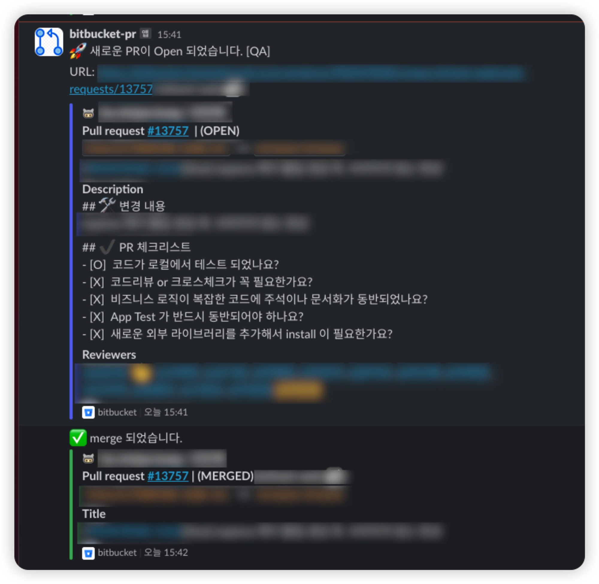
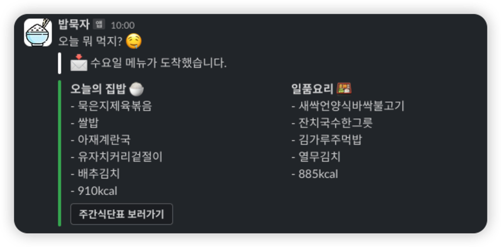

정신 없이 지나 간 2023년  어떤일들이 있었지?? 기억을 되짚어보려고 간단하게 회고 작성을 합니다.

> 2024년에는 더 발전 된 내 모습을 기대하며.
>

## STEP 1  - 회사의 위기 ☠️

2022년에 스타트업으로의 이직은 나에게 참 큰 여정이었다. 이전의 회사에서의 경험과는 달리, 스타트업에서의 팀간 협업과 열린 분위기에 좋은 기운을 느꼈다. 규모가 큰회사에서는 서로간의 소통이 쉽지 않았던 것과는 다르게, 스타트업에서는 CTO님과  훌륭한 기획, 디자인, 개발 팀과의 협업이 눈에 띄게 원활했다.  그러나 예기치 못한 위기가 찾아왔다. 투자 유치 실패, 회사 경영 악화로 이어지면서 권고 사직을 받게 되었고, 신규 서비스를 오픈하지 못하고 팀원들과의 이별이 아쉬웠습니다. 그래도 나는 회사에 남아서 소수의 개발팀원들과 함께 운영 중인 서비스를 유지보수하며, 적자 탈출을 위해 비용을 줄이는 작업들을 진행 했다.

## STEP 2 - 새로운 회사 🔥

이후 아는분 소개로 회사를 이직하게 되었다. 프로젝트 같이 개선해보자라는 이야기와 그당시 한국 경제상황이 좋지 않아 투자 유치도 힘들고  많은 회사들이 권고 사직 및 회사 문을 닫고 있었다. 그래서 결국 동료 소개를 받은 회사로 이직을 선택하게 되었다.

입사해서 회사 문화에 잘 녹아들어가고 팀원들고 친밀감을 쌓는 과정을 거친 이후 코드 리팩토링 및 개선 작업을 진행 했다.

다만 아쉬운 부분은 팀원들의 열정과 의지가 기대에 못 미치는 부분이 아쉬웠다. 지인이랑 둘이서만 뭔가 개선을 하려고 노력하고 다른분들은 크게 관심이 없는거 같았다. 모두 같이 윈윈 한다면 진짜 자신의 이력에 많은 도움이 될 것 같은데  많이 아쉽다. 그래도 좋은 팀장님과 팀원들이 있어서 열심히 개발을 진행하고 있다. ( 내 회고글을 팀원들이 볼 일은 없겠지만 만약 본다면, 적극적으로 참여 하고,  서로 많은 의견을 주고 받으면서 협업을 하고 싶다. 그냥 물흐르듯 있는건 너무 시간이 아깝다고 느껴진다.)

개선할 부분이 많은건 나한테는 좋다.!  2024년에도 많은 부분을 개선 해야겠다~~~

## STEP 3 - 자동화 ⏱️

일하면서 노가다작업 및 반복작업을 하고 있는 모습을 보면, 효율성을 높이기 위한 자동화 작업을 진행 했다.

### 자동화 작업 1 - Bitbucket PR 알림 봇

첫번째로 bitbucket PR 알림 봇 개발
팀원들이 PR을 올릴 때마다 메신저로 입력하여, 전송하는 번거로운 작업을 개선하기 위해 Webhook을 활용한 알림 봇을 개발했습니다.
PR의 open, close, approve, reviewer, comment에 대한 정보를 감지하여 해당 내용을 특정 채널에 자동으로 전송하는 Hook을 구현했습니다.

이후에는 코드리뷰 알람을 고도화해서 팀원들과 리뷰에 대하여 코멘트 및 답글을 통해 좀더 서로 코드에 대하여 리뷰하는 문화를 만들고 싶다. ( 따라와주길…….🙏)

### 자동화 작업 2 - 오늘 뭐 먹지? 서비스

두 번째로는, 점심 메뉴를 효율적으로 알리기 위한 "오늘 뭐 먹지? 서비스"를 개발했습니다

오늘 뭐 먹지? 서비스 개발
구내식당에서 제공되는 집밥과 일품 2가지 식단의 메뉴 알람을 전송 하기위해 카카오 플러스 친구에 접근하여 주간 메뉴 이미지를 긁어오고, OCR을 통해 요일별 메뉴를 추출했습니다.
매일 오전 10시에 알람을 전송하여 팀원들이 점심 메뉴를 확인할 수 있도록 만들었습니다.

### 자동화 작업 3 - Event Alert Bot

세 번째 자동화 작업은 팀에서 진행하는 다수의 이벤트 페이지의 개발과 관련된 "Event Alert Bot"입니다.

Event Alert Bot 개발
매달 개발되는 수많은 이벤트 페이지의 open 및 close 날짜를 알기 위한 불편함을 해소하기 위해, 알람리스트 데이터를 추출하여  cronjob 스케줄 서버를 활용하여 이벤트 시작/종료 시간을 감지하고 알림을 전송하는 Hook을 개발했습니다.
팀 내에서 이벤트 페이지의 작업 일정을 효율적으로 파악할 수 있게 되었다.

## STEP 4 - 내년 계획 🤩

내년에는 현재 개발 중인 서비스의 버전 마이그레이션 및 Next.js로의 전환 작업을 계획하고 있습니다. 또한, 영어 공부를 위해 스픽 앱을 결제하고 공부하기 (작심1달 금지) , 개발 관련 서적을 3달에 1권씩 읽는 것을 목표로 삼고 있다. 개발서적 수집은 이제 그만!

건강을 위해 런닝을 통한 다이어트에도 도전하고 있습니다. 마지막으로 GPT API를 활용하여 서비스 접목시키는 아이디어 및 학습도 진행할 계획이다.  이러한 목표들을 통해 더 나은 개발자로 성장하고자 합니다.

## 2024년 청룡! 가보자고 ~~~~ 🐉 🐉
